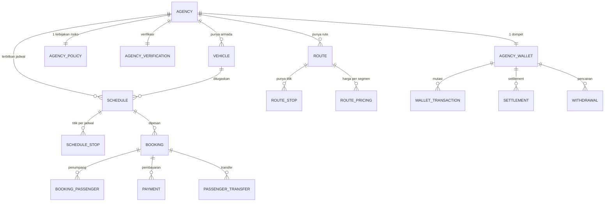
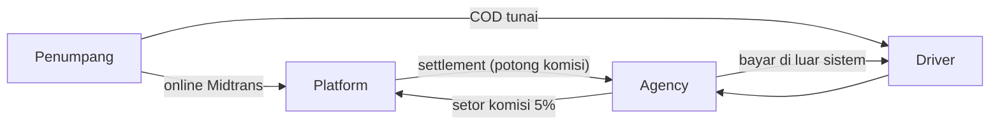

# 01 — Temuan Legacy & Keputusan yang Dibutuhkan

> Hasil verifikasi langsung ke kode, bukan dari ringkasan.
> **Sumber:** `/home/ngidengode/weweb/go-go-gomad/` (di luar workspace ini)
> **Status:** recon selesai untuk skema inti, enum, config, dan inventaris. Logika service belum dibedah.

---

## 1. Ringkasan verifikasi

Klaim di `legacy/01-p0-wajib.md` **akurat**. Yang terverifikasi:

| Komponen | Nilai terverifikasi |
|---|---|
| Backend | Laravel (`gomadid/`), API + Web Blade satu aplikasi |
| Migration | **68 file** (2016_08_03 s/d 2026_09_08) |
| Model | **50 model** |
| Enum | **10 file** |
| Service | **26 file** |
| Route | `web.php` **598 baris**, `api.php` **589 baris** |
| Monorepo | `gomadid`, `gomad_app` (Flutter), `gomad-baileys`, `gomad-docs`, `demo-static`, `memories` |
| Artefak rilis | 3 APK (`GoMad-v1.0.0-*.apk`) |

---

## 2. Temuan yang mengubah desain

### 2.1 Saldo mengendap sudah ada — tapi modelnya berbeda dari yang kamu mau

Ini temuan terpenting. Legacy **sudah** punya konsep ini, hanya bentuknya beda.

**`agency_wallets`** — 1 wallet per agency, **7 kolom saldo**:

```
available_balance · pending_balance · deposit_balance · cod_hold_balance
cod_credit_balance · total_earned · total_withdrawn
```

**`schedules.cod_min_balance`** default **Rp 500.000 — per jadwal, konstanta statis.**

**`agency_policies`** — mesin kebijakan risiko per agency:

| Kolom | Arti |
|---|---|
| `cod_min_balance` | Saldo minimum untuk COD (0 = ikut global) |
| `cod_daily_limit` | Limit COD per hari |
| `cod_max_per_booking` | Limit COD per booking |
| `allow_cod_without_deposit` | Boleh COD walau deposit 0 |
| `ots_min_deposit` | Deposit minimum untuk OTS (rental) |
| `credit_limit` | **Boleh saldo minus sampai batas** |
| `commission_override` | Komisi khusus per agency |
| `settlement_schedule` | daily / weekly / monthly |

**Kesimpulan:** permintaanmu — *deposit = kapasitas seat × total komisi platform, dihitung per jadwal* — adalah **evolusi dari `schedules.cod_min_balance`**. Tempatnya sudah ada; yang berubah: dari **konstanta** menjadi **formula**.

Kabar baik: bukan fitur dari nol. Kabar buruknya: ada **konflik filosofi**.

> ⚠️ **Konflik yang harus diputuskan.**
> Legacy mengizinkan **saldo minus** (`credit_limit`) — artinya platform memberi kredit ke agency.
> Permintaanmu sebaliknya: agency wajib menyimpan **saldo positif mengendap** sebagai jaminan.
> Dua model risiko yang **bertolak belakang**. Kalau keduanya dibiarkan hidup, aturan risiko jadi kabur dan sulit diaudit.

### 2.2 Tidak ada dompet untuk driver

`agency_wallets` hanya punya **1 wallet per agency** (`agency_id` unique). **Driver tidak punya akun ledger.**

Artinya di legacy: uang mengalir **penumpang → platform → agency**, dan agency membayar driver **di luar sistem**.

Ini bertabrakan dengan kebutuhan **multi-party split settlement** yang muncul dari `Service Fee Model`. Kalau driver (dan nanti pemilik armada terpisah) harus menerima bagian langsung, Core butuh **akun ledger per pihak**, bukan per agency.

### 2.3 `WalletTransactionType` hanya `credit` / `debit`

```php
enum WalletTransactionType: string {
    case CREDIT = 'credit';
    case DEBIT  = 'debit';
}
```

Tidak ada **kategori** transaksi. Konsekuensi: sistem tahu uang berpindah, tapi **tidak tahu kenapa** — komisi? pencairan? pelepasan deposit? refund? hold COD?

Untuk ledger Core, minimal butuh: `type` (kategori), `reference` (ke entitas sumber), `balance_after` (snapshot), `direction`. Ini gap serius, bukan kosmetik — tanpa ini rekonsiliasi tidak mungkin.

### 2.4 Fee ada tiga istilah yang belum jelas hubungannya

`bookings` punya kolom: `base_price`, `service_fee`, `platform_fee`, `discount_amount`, `total_price`.
`rentals` baru mendapat `service_fee` (migration 2026_09_04).
Config: `commission_rate = 5`, `warung_commission_rate = 2`.

Tiga konsep uang hidup bersamaan tanpa definisi tertulis. **Kalau salah tafsir di sini, seluruh settlement salah.**

### 2.5 Status jadwal & trip tidak punya enum — tapi ada mesin approval

- **Tidak ada `ScheduleStatus`.** Status jadwal tersusun dari: `approval_status` (`approved`/`pending`/`rejected`) + `is_active` + `started_at`/`finished_at`.
- **Tidak ada `TripStatus`.** "Trip" = `BookingStatus.ON_GOING` + `driver_locations`. Trip bukan entitas berdiri sendiri.
- Ada alur nyata **supir mengajukan jadwal → agency menyetujui** (`proposed_by`, `approved_by`, `approved_at`, `rejection_reason`).

State machine yang **sudah terdokumentasi di kode** (punya method `canTransitionTo`):

```
BookingStatus : pending → {confirmed, paid, cancelled}
                confirmed → {paid, cancelled, on_going}
                paid → {on_going, cancelled}
                on_going → {completed}
                cancelled, completed → FINAL

RentalStatus  : pending → {paid, cancelled}
                paid → {active, cancelled}
                active → {returned} → {completed}
                completed, cancelled → FINAL

PaymentStatus : 12 nilai, 3 jalur paralel + jalur refund
                digital : pending → {paid, failed, expired, refunded}
                COD     : cod_pending → cod_confirmed
                OTS     : ots_pending → ots_confirmed
                refund  : refund_pending → {approved, rejected}
                punya isFinal()
```

Yang **tidak** punya transisi eksplisit: `SettlementStatus`, `WithdrawalStatus`, `DocumentVerificationStatus`.

### 2.6 Role pakemnya `payment_agent`, bukan "warung"

```php
enum UserRole: string {
    customer · agency · driver · admin · payment_agent
}
```

"Warung GoMad" = role **`payment_agent`**. Ini menyelesaikan tabrakan istilah yang saya khawatirkan: di kode sudah jelas — `payment_agent` (titik bayar) vs pembeli grosir (Mad Warung). Tidak perlu nama baru.

Yang **belum ada**: `agency_staff`, `finance`. Agency = 1 user. Kalau nanti butuh operator/dispatcher/kasir per agency, itu **fitur baru**, bukan migrasi.

### 2.7 Warung POS sudah punya katalog & stok

Model yang ada: `Product`, `ProductCategory`, `StockMovement`, `PosTransaction`, `PosTransactionItem`.

Jadi warung POS bukan sekadar titik bayar — sudah ada **katalog produk + pergerakan stok**. Ini bisa jadi fondasi Mad Warung.

### 2.8 Midtrans sandbox — dikonfirmasi

`config/gomad.php`: `'is_production' => env('MIDTRANS_IS_PRODUCTION', false)`.

**Uang belum pernah benar-benar berpindah.** Artinya seluruh desain settlement — termasuk saldo mengendap — belum teruji di dunia nyata. Ini risiko terbesar di proyek ini, dan tidak bisa ditutup dengan desain; hanya bisa ditutup dengan transaksi nyata pertama.

### 2.9 Parameter bisnis yang sudah terkunci

Dari `config/gomad.php`:

| Parameter | Nilai |
|---|---|
| `commission_rate` | 5 (%) |
| `warung_commission_rate` | 2 (%) |
| `booking_code_prefix` | `GM` |
| `payment_code_prefix` | `WM` |
| `payment_timeout_minutes` | 30 |
| `payment_code_expiry_hours` | 24 |
| `schedule_min_days_before` | 30 |
| `minimal_withdrawal` | Rp 100.000 |
| `withdrawal_admin_fee` | Rp 5.000 |
| `auto_approve_limit` | Rp 5.000.000 |
| `settlement_day` | Senin |
| `driver_min_rating` | 3.0 |
| Bagasi | economy 15kg · premium 20kg · charter 25kg |

### 2.10 Travel & Charter sudah satu, Rental sudah terpisah

Di legacy:
- **Travel + Charter** = sama-sama di `schedules`, dibedakan `travel_class` (`economy`/`premium`/`charter`)
- **Rental** = tabel `rentals` sendiri, dengan `rental_type` (`self_drive`/`with_driver`)

Ini **menolak asumsi saya** bahwa Travel/Charter/Rental harus jadi 3 sub-domain terpisah. Legacy sudah memilih pembagian: **berbasis jadwal vs berbasis unit**. Dan itu masuk akal, karena `schedules` punya armada + kursi + rute, sedangkan `rentals` menjual unit per hari.

### 2.11 Data lain yang perlu dicatat

- `users` punya `manual_customer` + `onboarding` → banyak booking **dibuatkan admin**, bukan self-service customer.
- `PickupZone` → door-to-door memakai **zona jemput**, bukan sekadar lat/long bebas.
- `schedules` punya mesin transfer penumpang: `allow_passenger_transfer`, `accept_external_transfer`, `transfer_fee_per_passenger` (Rp 20.000), `max_transfer_fee_percent` (20%), `transferred_out_count`, `transferred_in_count`.
- **Drift migrasi terkonfirmasi**: ada `drop_max_overload`, 4 migration penambahan index, `make nullable`, `change seat_number to string`. Migration = niat historis, **bukan** skema produksi.

---

## 3. Peta domain legacy (terverifikasi)



**Alur uang legacy:**



Terlihat jelas: **driver hanya menerima lewat agency, di luar sistem.** Tidak ada leg ledger untuk driver.

---

## 4. Keputusan yang dibutuhkan

| # | Keputusan | Kenapa krusial |
|---|---|---|
| **D1** | **Filosofi risiko: `credit_limit` (boleh minus) atau deposit gating (wajib positif)?** | Dua model bertolak belakang. Harus pilih satu, atau definisikan dengan tegas kapan masing-masing berlaku |
| **D2** | **Formula deposit per jadwal**: `kapasitas kursi × komisi per kursi × berapa?` Diambil kapan — saat publish jadwal? Di-realisasi kapan? | Ini inti permintaanmu. Legacy: konstanta Rp 500.000. Perlu formula + waktu pengambilan + waktu pelepasan |
| **D3** | **Beda `service_fee` vs `platform_fee` vs `commission_rate`** — mana dipotong dari agency, mana dibebankan ke customer? | Salah di sini = seluruh settlement salah |
| **D4** | **Driver & pemilik armada punya akun ledger sendiri?** | Menentukan apakah Core butuh multi-account ledger atau cukup per-agency |
| **D5** | **Jadwal & trip dijadikan entitas dengan state machine eksplisit?** | Di legacy tersebar di 3 kolom + timestamp. Kalau tidak dirapikan, bug yang sama akan terulang |
| **D6** | **Daftar final kategori transaksi wallet** | Tanpa ini, rekonsiliasi dan audit tidak mungkin |
| **D7** | **POS warung (`Product`/`StockMovement`/`PosTransaction`) dipakai ulang untuk Mad Warung, atau model baru?** | Menentukan apakah Mad Warung mulai dari nol atau mewarisi model yang sudah ada |
| **D8** | **Bisa dapat DDL dump produksi?** | Migration sudah terbukti drift. Tanpa ini, kita membangun di atas skema yang mungkin salah |

---

## 5. Yang belum saya periksa

Supaya jelas batas recon ini:

- **Isi 26 service** (aturan bisnis nyata: TTL seat lock, cutoff, refund, Koin COD) — baru sebagian terbaca dari `config`
- **Kolom `settlements`, `withdrawals`, `wallet_transactions`, `payments`, `cash_payments`, `payment_agents`, `pos_*`**
- **Detail `routes/api.php` & `web.php`** → belum diubah jadi tabel role × endpoint
- **Logika Koin COD** (`cod_credit_balance` + kode `WM` + PIN warung)
- **Idempotency callback Midtrans**
- **Jumlah baris per tabel di produksi**

---

## 6. Langkah berikutnya

Urutan yang saya sarankan:

1. **Jawab D1–D8** (terutama D1, D2, D3) — ini memblokir desain `Core/Wallet` & `Settlement`
2. **D8** — kejar DDL dump produksi; tanpa itu semua desain berisiko
3. **Bedah 26 service** → dokumen aturan bisnis (P0-3 versi lengkap)
4. **Generate tabel role × endpoint** dari `routes/` (bisa tanpa akses produksi)
5. **Baru** susun `openapi.yaml` + skeleton Core
