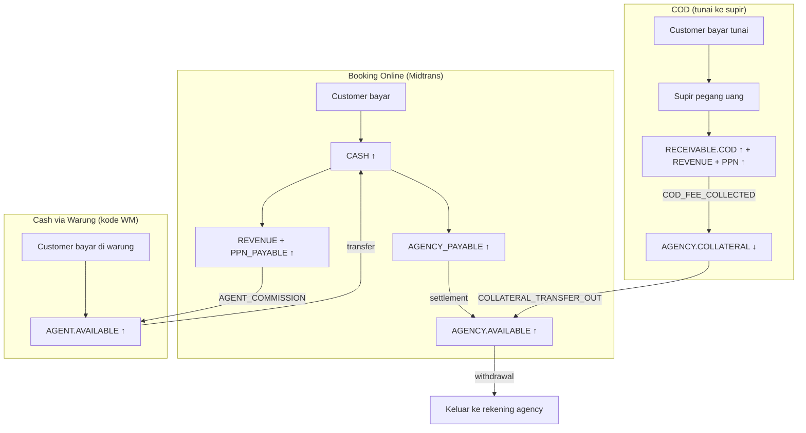

# 05 — Desain GoMad Core

> Menjawab **D2** (deposit gating), **D3** (model pendapatan), **D4** (lingkup ledger), **D6** (kategori transaksi).
> Rujukan aturan: `docs/04-checklist-jangan-diulang.md`

---

## 1. Prinsip

| Prinsip | Alasan |
|---|---|
| **Ledger berbasis akun, bukan tabel saldo berkolom** | Legacy menyimpan 7 saldo sebagai kolom di satu baris → tidak bisa menjawab "berapa hold untuk jadwal #42", dan tidak bisa direkonsiliasi |
| **Double-entry** | Setiap transaksi minimal 2 entri yang saling menutup. `SUM(debit) = SUM(credit)` = pemeriksaan otomatis |
| **Hold adalah record, bukan saldo** | Saldo hanya punya dua bentuk: `available` dan `collateral`. Jaminan adalah *klaim* atas saldo itu |
| **Idempotency di level ledger** | `idempotency_key` unique di tabel transaksi — bukan pengecekan `LIKE` di deskripsi |
| **Vertical hanya lewat Core** | `MadTrans` tidak pernah menyentuh ledger langsung; dia memanggil kontrak Core |

---

## 2. Struktur Ledger

```
ledger_accounts
  ├── id
  ├── code              (unik, mis. "AGENCY.AVAILABLE:42")
  ├── owner_type        ('platform' | 'agency' | 'agent')
  │                     ← nanti bisa 'driver' | 'owner' TANPA migrasi
  ├── owner_id          (null untuk akun platform)
  ├── account_class     ('asset'|'liability'|'revenue'|'expense'|'equity'|'receivable')
  ├── balance_cached    (cache; sumber kebenaran tetap entri)
  └── is_active

ledger_transactions
  ├── id
  ├── category          ← D6, daftar di bagian 4
  ├── reference_type / reference_id   (booking, rental, settlement, withdrawal, …)
  ├── idempotency_key   (UNIQUE)      ← kunci anti-duplikat
  ├── occurred_at, description, amount, status ('posted'|'reversed')

ledger_entries
  ├── id, transaction_id, account_id
  ├── direction ('debit'|'credit'), amount
  ├── balance_after     ← per akun, bukan per kantong ambigu
  └── UNIQUE(transaction_id, account_id, direction)

wallet_holds                                        ← pengganti kolom cod_hold_balance
  ├── id, account_id
  ├── source_type ('schedule'|'rental'), source_id
  ├── reason ('cod_collateral'|'ots_deposit')
  ├── amount, status ('active'|'released'|'consumed'|'expired')
  ├── expires_at, released_at, transaction_id
  └── UNIQUE(source_type, source_id, reason)        ← mencegah double release
```

---

## 3. Bagan Akun (MVP)

**D4: MVP hanya punya akun agency.** Driver & pemilik armada menyusul tanpa migrasi.

| Akun | Kelas | Fungsi |
|---|---|---|
| `PLATFORM.CASH` | asset | Kliring Midtrans / rekening bank |
| `PLATFORM.AGENCY_PAYABLE` | liability | Uang customer yang **jadi hak agency**, belum disetor |
| `PLATFORM.REVENUE.SERVICE_FEE` | revenue | Biaya layanan |
| `PLATFORM.REVENUE.PLATFORM_FEE` | revenue | Biaya platform |
| `PLATFORM.REVENUE.WITHDRAWAL_FEE` | revenue | Biaya admin pencairan |
| `PLATFORM.LIABILITY.PPN_PAYABLE` | liability | **PPN keluaran — bukan pendapatan** |
| `PLATFORM.RECEIVABLE.COD_FEE` | receivable | Piutang fee dari transaksi COD |
| `PLATFORM.EXPENSE.AGENT_COMMISSION` | expense | Komisi warung (2%) |
| `PLATFORM.EXPENSE.PROMO` | expense | Diskon yang ditanggung platform |
| `AGENCY.AVAILABLE:<id>` | liability | Saldo bebas agency |
| `AGENCY.COLLATERAL:<id>` | liability | **Saldo mengendap** (deposit) |
| `GROSIR.AVAILABLE:<id>` | liability | Saldo grosir (Mad Warung) — utang GoMad kepada grosir |
| ~~`AGENT.AVAILABLE`~~ | — | Dibatalkan di MVP — tidak ada bayar tunai di warung |

> **Catatan penting:** **warung tidak punya akun.** Warung membayar lewat **payment gateway per transaksi**, bukan menyimpan saldo.
> Yang punya saldo hanyalah **pihak yang menerima uang dari GoMad** (agency & grosir) — itulah bentuk *dompet mitra* di GoMad.

**Catatan D4:** penambahan `DRIVER.AVAILABLE` atau `OWNER.AVAILABLE` nanti = **insert satu baris**, bukan migrasi skema dan bukan perubahan kode ledger.

---

## 4. Kategori Transaksi (D6)

18 kategori. Kolom `category` inilah yang membuat ledger bisa ditelusuri dan direkonsiliasi.

### Pendapatan

| Kategori | Pemicu | Entri |
|---|---|---|
| `BOOKING_PAID_ONLINE` | Customer bayar via Midtrans | Dr `CASH` · Cr `AGENCY_PAYABLE`, Cr `REVENUE.SERVICE_FEE`, Cr `REVENUE.PLATFORM_FEE`, Cr `PPN_PAYABLE` |
| `BOOKING_COD_CONFIRMED` | Supir konfirmasi penumpang naik, bayar tunai | Dr `RECEIVABLE.COD_FEE` · Cr `REVENUE.*`, Cr `PPN_PAYABLE` |
| `RENTAL_PAID` | Rental dibayar | Sama seperti `BOOKING_PAID_ONLINE`, referensi rental |
| `WITHDRAWAL_FEE` | Biaya admin pencairan | Dr `AGENCY.AVAILABLE` · Cr `REVENUE.WITHDRAWAL_FEE` |
| `AGENT_COMMISSION` | Warung bantu pembayaran tunai | Dr `EXPENSE.AGENT_COMMISSION` · Cr `AGENT.AVAILABLE` |

### Jaminan (deposit)

| Kategori | Pemicu | Entri |
|---|---|---|
| `COLLATERAL_TOPUP` | Agency isi deposit | Dr `CASH` · Cr `AGENCY.COLLATERAL` |
| `COLLATERAL_TRANSFER_IN` | Pindah dari saldo bebas ke deposit | Dr `AGENCY.AVAILABLE` · Cr `AGENCY.COLLATERAL` |
| `COLLATERAL_TRANSFER_OUT` | **Tarik deposit kembali** (memperbaiki bug legacy) | Dr `AGENCY.COLLATERAL` · Cr `AGENCY.AVAILABLE` |
| `COD_FEE_COLLECTED` | Fee COD ditarik dari deposit | Dr `AGENCY.COLLATERAL` · Cr `RECEIVABLE.COD_FEE` |
| `COD_FEE_ARREARS` | Deposit tak cukup → tunggakan jadi **entitas ledger**, bukan JSON | Dr `AGENCY.AVAILABLE` (negatif ditolak; dicatat sebagai piutang) · Cr `RECEIVABLE.COD_FEE` |

> `wallet_holds` **tidak** menghasilkan entri ledger — hold bukan perpindahan uang.
> Yang bergerak uang hanya `COD_FEE_COLLECTED`.

### Settlement & pencairan

| Kategori | Pemicu | Entri |
|---|---|---|
| `SETTLEMENT_TO_AGENCY` | Siklus settlement (default Senin) | Dr `AGENCY_PAYABLE` · Cr `AGENCY.AVAILABLE` |
| `WITHDRAWAL_REQUEST` | Agency mengajukan pencairan | Dr `AGENCY.AVAILABLE` · Cr `CASH` (setelah dieksekusi) |
| `WITHDRAWAL_REVERSAL` | Pencairan gagal | Kebalikan, **idempoten** |

### Refund & koreksi

| Kategori | Pemicu | Entri |
|---|---|---|
| `REFUND_APPROVED` | Refund disetujui | Dr `AGENCY_PAYABLE` · Cr `CASH` |
| `REFUND_CASH_VIA_AGENT` | Refund tunai lewat warung — **legacy tidak punya pemroses** | Dr `AGENCY_PAYABLE` · Cr `AGENT.AVAILABLE` |
| `PPN_REMITTANCE` | Setor PPN ke negara | Dr `PPN_PAYABLE` · Cr `CASH` |
| `ADJUSTMENT` | Koreksi manual, **wajib alasan + jejak admin** | Bebas |

---

## 5. Deposit Gating (D2 — final)

### Rumus

```
fee_per_kursi   = service_fee + platform_fee + PPN_per_kursi
hold_awal       = kapasitas_kursi × fee_per_kursi          ← saat jadwal diaktifkan
hold_aktif      = (kapasitas − kursi_yang_komisinya_disetor) × fee_per_kursi
```

### Aturan

| Aturan | Nilai |
|---|---|
| **Gate** | Jadwal COD hanya aktif kalau `COLLATERAL.tersedia ≥ hold_awal` |
| `COLLATERAL.tersedia` | `balance − SUM(wallet_holds aktif)` |
| **Pelepasan** | Per kursi, saat komisinya masuk lewat `COD_FEE_COLLECTED` |
| **Evaluasi ulang** | Saat: aktivasi jadwal · perubahan kapasitas · perubahan harga/override · top-up · penarikan · setiap settlement |
| **Jika deposit kurang** | Blokir **booking COD baru** saja. **Tidak** membatalkan tiket terjual. Tandai jadwal `risk_status = warning/blocked`, beri tahu agency + ops |
| **Jadwal PP** | Hold per **keberangkatan**, bukan per rute |
| **Penarikan** | Hanya dari `AVAILABLE` dan dari `COLLATERAL.tersedia`. Tidak boleh membuat `hold_aktif > balance` |

### Yang diperbaiki dari legacy

| Legacy | GoMad baru |
|---|---|
| Hold = kolom `cod_hold_balance` | `wallet_holds` dengan `unique(source, reason)` |
| Deposit terkunci permanen | `COLLATERAL_TRANSFER_OUT` — dua arah |
| Deposit 500rb + 1 jadwal → semua COD ditolak | Rumus `tersedia = balance − hold_aktif` |
| Double release oleh cron | Hold punya status + unique constraint |
| Dua sumber kebenaran (`route` vs `schedule`) | Satu sumber: kebijakan di `agency_policy`, nominal dihitung per jadwal |
| Tunggakan di JSON | `COD_FEE_ARREARS` sebagai entri ledger |

---

## 6. Alur Uang per Kanal



**Kunci desain:** pada COD, platform **tidak** memegang uang customer — dia memegang **piutang fee** yang dijamin deposit. Inilah mengapa deposit gating ada.

---

## 7. Settlement dengan PPN

Rincian settlement yang harus tampil (memperbaiki A12):

```
  fare agency                     Rp xxx
+ service fee                     Rp xxx
+ platform fee                    Rp xxx
─────────────────────────────────────────
= dibayar customer                Rp xxx
  PPN 11% × (service + platform)  Rp xxx   → PPN_PAYABLE
  komisi warung 2% (jika cash)    Rp xxx   → EXPENSE.AGENT_COMMISSION
─────────────────────────────────────────
= REVENUE platform bersih         Rp xxx
  fare agency                     Rp xxx   → AGENCY_PAYABLE
```

**Prinsip:** agency menerima **100% fare**. Platform tidak pernah memotong dari harga tiket.

### Struktur fee final (FORMULA)

```
service_fee   = Rp 5.000                       (flat)
platform_fee  = 3% × fare
PPN           = 11% × (service_fee + platform_fee)

total_customer = fare + service_fee + platform_fee + PPN
               = fare + 5.000 + 0,03×fare + 0,11×(5.000 + 0,03×fare)
               ≈ 1,0333 × fare + 5.550

agency_net     = fare                            (tetap 100%, tidak pernah dipotong)
platform_net   = service_fee + platform_fee      (pendapatan bersih)
PPN            = kewajiban pajak → PPN_PAYABLE
```

**Contoh nyata** (fare Rp 150.000 — sesuai rute Sumenep → Surabaya di gomad.id):

| Komponen | Nominal |
|---|---|
| fare agency | Rp 150.000 |
| service fee | Rp 5.000 |
| platform fee (3%) | Rp 4.500 |
| **subtotal komisi** | **Rp 9.500** |
| PPN 11% | Rp 1.045 |
| **Dibayar customer** | **Rp 160.545** |
| Platform bersih | Rp 9.500 |
| Agency terima | Rp 150.000 |

### ⚠️ Asumsi yang perlu kamu koreksi kalau salah

Saya mengasumsikan PPN **ditambahkan ke customer** (Opsi A), karena kamu menyebut tax sebagai salah satu komponen penerimaan platform bersama service fee dan platform fee.

Kalau maksudmu PPN **dipotong dari fee platform** (Opsi B), maka: customer tetap bayar Rp 159.500, platform bersih Rp 8.455, dan sisa Rp 1.045 jadi utang pajak. Bedanya hanya siapa yang menanggung — **koreksi saya kalau asumsinya salah.**

### Dampak ke deposit gating — temuan menarik

Dengan rumus ini, jaminan per kursi jadi **proporsional harga tiket**:

```
fee_per_kursi = 5.000 + 0,03×fare + 0,11×(5.000 + 0,03×fare)
```

| Rute | Fare | fee/kursi | Hold 8 kursi | Legacy (flat 500rb) |
|---|---|---|---|---|
| Sumenep → Surabaya | Rp 150.000 | Rp 10.545 | **Rp 84.360** | Rp 500.000 |
| Surabaya → Banyuwangi | Rp 300.000 | Rp 15.540 | **Rp 124.320** | Rp 500.000 |

**Artinya:** angka flat Rp 500.000 di legacy **menahan 4–6× lebih besar** dari yang sebenarnya dibutuhkan. Ini menjelaskan kenapa agency mengeluh dan COD sering diblokir — bukan karena aturannya salah, tapi karena nominalnya tidak masuk akal untuk rute ekonomi.

---

## 8. Idempotency

| Lapisan | Mekanisme |
|---|---|
| Webhook | Verifikasi **signature** (wajib semua: booking, topup, settlement, **disbursement**) |
| Handler | Cek `ledger_transactions.idempotency_key` **di dalam** DB transaction, sebelum posting |
| Eksekusi | `lockForUpdate` pada akun **di dalam** transaction, bukan di luar |
| Reversal | Selalu transaksi baru ber-`category` reversal, tidak pernah `update`/`delete` entri lama |
| Callback gagal | Tidak boleh memicu pengembalian dana berulang — status diperiksa lebih dulu |

**Tes wajib:** kirim callback yang sama 3× → saldo berubah **sekali**.

---

## 9. Identity & Access (ringkas)

- Satu identitas, banyak peran (prinsip *Unified User Identity* dari mindmap)
- Peran MVP: `customer`, `agency`, `driver`, `admin`, `payment_agent`
- **Perbaikan dari legacy:** tabel **permission berbasis aksi** (bukan cek `role` tunggal di middleware). Agar `agency_staff` dan `finance` bisa ditambah tanpa membongkar otorisasi
- Agen enterprise (multi-user) masuk lewat penambahan peran, bukan penambahan tabel

---

## 10. Yang masih terbuka

### Sudah diputuskan

| Item | Keputusan |
|---|---|
| Struktur fee | service fee flat Rp 5.000 · platform fee 3% · PPN 11% |
| **D7** | POS warung **tidak dipakai lagi**. Mad Warung dibangun ulang dengan konsep baru (intermediary warung ↔ grosir) |
| Siklus settlement | **Default mingguan, hari Sabtu**; tiap agency bisa atur sendiri |
| **D9 — TTL kursi** | **Tidak ada angka terpisah.** Penahanan kursi = durasi waktu pembayaran |
| **D10 — Cutoff penjualan** | Travel 60 menit · rute panjang 120 menit (configurable per rute) |
| **Bayar tunai di warung** | **Tidak ada di MVP** |

### Amandemen: TTL kursi = durasi pembayaran

Legacy punya dua angka yang bersaing (kursi ditahan 30 menit, 24 jam, atau tanpa batas). GoMad baru memakai **satu** angka: `payment_timeout`.

| Kanal | Penahanan kursi |
|---|---|
| Online (Midtrans) | = `payment_timeout` (legacy: 30 menit) |
| COD | Tidak ditahan berdasarkan pembayaran — kursi terpakai sampai keberangkatan |

**No-show COD dibiarkan** (keputusan produk). Konsekuensi yang harus diingat:

1. Hold COD bertahan sampai settlement, karena fee belum tertagih
2. **Pelepasan hold punya dua jalur:**
   - **Tertagih** — penumpang naik, fee masuk lewat `COD_FEE_COLLECTED`
   - **Void** — no-show atau batal, hold dilepas **tanpa** penagihan
3. Kalau jalur void tidak diimplementasikan, hold akan menumpuk dan agency terkunci tanpa alasan — persis bug legacy

### Amandemen: deposit gating jadi PER-BOOKING COD

Rumus di bagian 5 direvisi. **Bukan** per kapasitas jadwal, tapi per booking:

```
hold_per_booking = fee_per_kursi
hold_aktif(schedule) = jumlah booking COD aktif × fee_per_kursi
gate: COLLATERAL.tersedia ≥ fee_per_kursi   ← diperiksa saat booking COD dibuat
```

| | Per kapasitas (usulan awal) | **Per booking (revisi)** |
|---|---|---|
| Kapan di-gate | Saat jadwal diaktifkan | Saat booking COD dibuat |
| Jaminan saat jadwal kosong | Kapasitas × fee | **Rp 0** |
| Jaminan saat 3 kursi COD terjual | Kapasitas × fee | **3 × fee** |
| Risiko | Over-collateralize — masalah yang sama dengan flat Rp 500.000 | Eksposur bertambah bertahap, ter-gate otomatis |

**Batas teoretis** tetap `kapasitas × fee_per_kursi`, tapi itu hanya plafon — bukan aturan operasional. Karena booking dibatasi kapasitas, plafon itu tidak mungkin terlewati.

**Alasan revisi:** eksposur platform hanya nyata kalau ada penumpang COD yang benar-benar naik. Mensyaratkan jaminan penuh di muka untuk kursi yang mungkin tidak pernah terjual adalah **kesalahan yang sama** dengan flat Rp 500.000 di legacy — hanya dengan rumus yang lebih rapi.

### Ditunda dari MVP (bukan dihapus dari desain)

Karena ledger berbasis akun, semua ini bisa dinyalakan nanti **tanpa migrasi skema**:

| Item | Cara menyalakan nanti |
|---|---|
| Titik bayar tunai di warung | Tambah akun `AGENT.AVAILABLE:<id>` — satu baris |
| Akun driver / pemilik armada | Tambah `DRIVER.AVAILABLE` / `OWNER.AVAILABLE` — satu baris |
| Kategori `AGENT_COMMISSION` | Sudah terdefinisi di bagian 4, tinggal diaktifkan |

### Masih terbuka

| # | Item | Kenapa penting |
|---|---|---|
| 1 | **Konfirmasi asumsi PPN** — ditambahkan ke customer (A) atau dipotong dari fee (B)? | Menentukan tampilan harga & proyeksi pendapatan |
| 2 | Apakah platform fee 3% dihitung dari `fare` saja? | Saat ini diasumsikan dari `fare` |
| 3 | Angka final sebagai **default platform** untuk TTL & cutoff (bisa diubah agency) | Menentukan perilaku checkout |
