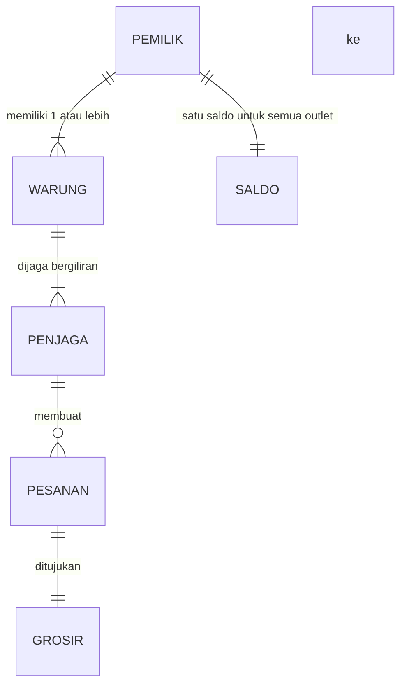
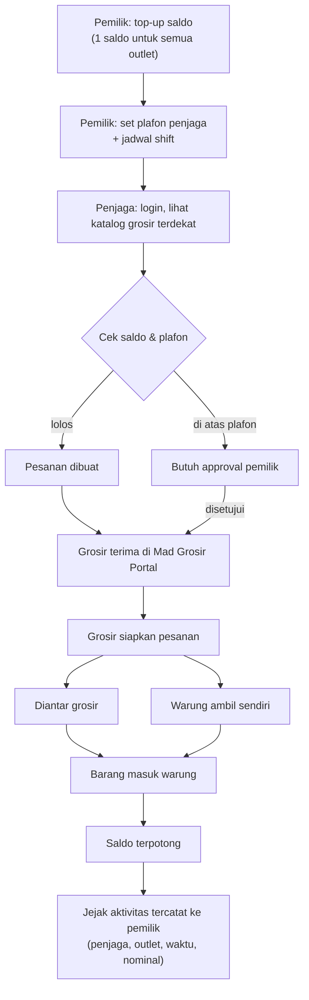
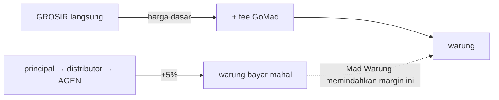

# 08 — Konsep Mad Warung · v1

> **Dokumen ini adalah rujukan tunggal konsep Mad Warung.** Disusun dari sesi pematangan konsep.
> Catatan proses & koreksinya ada di `docs/07-konsep-mad-warung.md`.
> Status: **konsep inti terkunci · 4 hal masih terbuka**

---

## 1. Ringkasan

**Satu kalimat:**
> Mad Warung adalah marketplace yang membuat warung sembako mendapat **harga grosir** tanpa harus antri atau keliling — dan kulakan 2× sehari jadi semudah sekali klik.

**Satu paragraf:**
Warung sembako hari ini membeli barang dari **agen distributor**, yang harganya ±5% lebih mahal daripada **grosir**. Untuk mendapat harga grosir, warung harus meninggalkan dagangannya, pergi ke grosir, dan antri — hal yang nyaris mustahil bagi **warung Madura yang buka ~24 jam**. Mad Warung menghapus perjalanan dan antrian itu: warung memesan lewat aplikasi, grosir menyiapkan pesanan, lalu barang **diantar grosir** atau **diambil warung sendiri** setelah siap.

---

## 2. Masalah yang dipecahkan

| Yang dihapus | Yang tetap ada |
|---|---|
| **Antri** di grosir | Perjalanan — kalau warung memilih ambil sendiri (tapi singkat & pasti) |
| **Keliling** membandingkan harga | — |
| Meninggalkan warung dalam waktu lama | — |

**Pesaing sesungguhnya** (bukan sesama aplikasi):

1. Warung jalan sendiri ke grosir — yang paling menderita
2. **Salesman/canvasser grosir** yang mendatangi warung — model dominan hari ini
3. WhatsApp ke grosir langganan — digital tapi tanpa katalog & rekam jejak

---

## 3. Posisi bisnis

**Marketplace (intermediary)** antara Grosir dan Warung retail.

- Grosir tetap penjual; GoMad perantara permintaan
- **Asset-light** — tanpa modal kerja barang, tanpa gudang

---

## 4. Struktur pengguna

Ini yang membedakan Mad Warung dari sekadar aplikasi belanja:



| Lapis | Peran |
|---|---|
| **Pemilik Warung** | Bisa memiliki banyak warung. Memegang saldo, menetapkan plafon & jadwal, melihat seluruh aktivitas |
| **Warung (outlet)** | Unit fisik. Punya laporan & aktivitas sendiri, tapi saldo dipooling di pemilik |
| **Penjaga Warung** | Akun sendiri. Punya jadwal shift. **Dia yang melakukan kulakan** |

### Mengapa struktur ini penting

Warung Madura buka ~24 jam → **pemilik tidak mungkin menjaga sendiri** → penjaga yang menjalankan, termasuk kulakan. Pemilik menyerahkan **uang dan stok** ke tangan orang lain, di lokasi yang tidak dia awasi.

> **Posisi Mad Warung: dari *alat belanja* menjadi *alat pengawasan usaha*.**

| | Posisi "alat belanja" | Posisi "alat pengawasan" |
|---|---|---|
| Yang dijual | Hemat 1,6% | **Ketenangan pemilik** |
| Ketahanan harga | Rapuh — pesaing tinggal potong fee | Lebih kuat — pemilik membayar untuk kendali |
| Cerita ke investor | "Marketplace sembako" | "Infrastruktur kendali untuk ribuan usaha 24 jam" |

---

## 5. Alur end-to-end



---

## 6. Nilai untuk tiap pihak

### Warung & pemilik

| Nilai | Kekuatan |
|---|---|
| **Waktu** | ⭐ Keunggulan sesungguhnya — warung tetap buka, tidak ditinggal |
| **Kendali** | ⭐ Pemilik bisa mengawasi uang & stok yang lewat tangan penjaga |
| Kemudahan | Sekali klik |
| Kelengkapan | Banyak grosir dalam satu tempat |
| Harga | ⚠️ **Syarat minimum, bukan keunggulan** — celah hanya 5% |

### Penjaga

Kulakan jadi tugas yang cepat & tercatat — tidak perlu izin per transaksi (selama di bawah plafon), dan tidak perlu meninggalkan warung.

### Grosir

| Keuntungan | Catatan |
|---|---|
| Dapat pelanggan warung baru | Jangkauan lebih luas |
| **Cara kerja inti tidak berubah** | Tetap punya salesman untuk antar, karyawan untuk menyiapkan |
| Naik ke ranah digital | Pesanan masuk lewat portal, bukan dari salesman |

---

## 7. Unit economics

### Celah harga hanya 5%

Dari lapangan: **agen distributor ±5% lebih mahal daripada grosir.** Seluruh ruang yang bisa diperebutkan GoMad adalah 5% — dan itu harus menanggung platform fee **dan** PPN.



### Simulasi

| Nilai pesanan | Harga agen | Lewat Mad Warung *(fee flat + 3% + PPN)* | Hasil |
|---|---|---|---|
| Rp 200.000 | Rp 210.000 | Rp 212.210 | **+2.210 lebih mahal** ❌ |
| Rp 500.000 | Rp 525.000 | Rp 522.200 | −2.800 (0,56%) |
| Rp 1.000.000 | Rp 1.050.000 | Rp 1.038.850 | −11.150 (1,06%) |

**Titik impas: pesanan ±Rp 332.000.** Di bawah itu warung **rugi**.

| Nilai pesanan | Lewat Mad Warung *(tanpa flat)* | Hasil |
|---|---|---|
| Rp 200.000 | Rp 206.660 | **−1,6%** ✅ |
| Rp 500.000 | Rp 516.650 | **−1,6%** ✅ |
| Rp 1.000.000 | Rp 1.033.300 | **−1,6%** ✅ |

**Kesimpulan:** tanpa komponen flat per pesanan, penghematan warung **konsisten 1,6%** di semua ukuran pesanan.

### Struktur fee

| Opsi | Struktur | Hemat warung |
|---|---|---|
| 1 | Platform fee 3%, tanpa service fee | 1,6% |
| **2** ⭐ | Platform fee 3% + **service fee bulanan** | 1,6% + biaya tetap bulanan |
| 3 | Platform fee 2% + service fee bulanan | 2,5% |

> **Dipilih: Opsi 2.** Tiga komponen pendapatan tetap utuh (platform fee, service fee, tax), tapi basis service fee diubah dari *per pesanan* menjadi *per bulan* — supaya frekuensi tinggi tidak dihukum.

---

## 8. Pengiriman

Tiga jalur, sesuai mindmap:

| Jalur | Padanan mindmap | Status |
|---|---|---|
| Grosir mengantar sendiri | *Supplier Self-Delivery* | Sekarang |
| **Warung ambil sendiri** setelah disiapkan | — | **Mekanisme penghapus antrian** |
| Partner / pihak ketiga | *Partner Delivery Network* | Nanti |

**Mad Logistics cukup minimal di MVP** — tidak perlu armada sendiri.

---

## 9. Pembayaran & saldo

**DIKOREKSI — lihat bagian 18.** Mad Warung **tidak punya saldo**. Pembayaran murni lewat **payment gateway**, per transaksi.

### Mengapa bukan transfer per pesanan

```
2 transfer/hari × 30 hari = ±60 transfer per warung per bulan
```

Model saldo: pemilik top-up ±4× sebulan; setiap pesanan memotong saldo otomatis.

| Pihak | Manfaat |
|---|---|
| Pemilik | Transfer 4× sebulan, bukan 60× |
| GoMad | Rekonsiliasi jauh lebih ringan — satu top-up, banyak pesanan |
| *North Star* | Friksi pembayaran hilang, frekuensi tidak terhambat |

### ⚠️ Konsekuensi yang harus dijawab: atribusi per outlet

Karena saldo **dipooling di pemilik**, satu pertanyaan muncul:

> Kalau tiga outlet memakai satu saldo, bagaimana pemilik tahu **outlet mana yang menghabiskan berapa**?

**Rekomendasi:** akun ledger di tingkat pemilik (`WARUNG_OWNER.AVAILABLE`), tapi setiap entri ledger **wajib membawa atribusi `outlet_id` + `penjaga_id`**.

Ini pola yang sama dengan yang kita pakai di platform: **satu saldo, dimensi untuk pelaporan.** Tanpa atribusi, pooling uang akan menyembunyikan siapa membelanjakan apa — dan justru merusak nilai "kendali" yang jadi jualan utama.

**Default yang saya ambil:** plafon ditetapkan **per penjaga** (karena penjaga yang bertransaksi), sementara laporan disajikan **per outlet dan gabungan**.

---

## 10. Kewenangan & kendali

| Kendali | Keputusan |
|---|---|
| **Plafon penjaga** | Ada. Penjaga tidak bisa kulakan melebihi plafon dari pemilik |
| **Approval** | Wajib untuk pesanan di atas plafon |
| **Jadwal shift** | Untuk **absensi & akuntabilitas** — **tidak** menggerakkan izin transaksi |
| **Jejak aktivitas** | Setiap kulakan tercatat: penjaga, outlet, waktu, nominal |
| Visibilitas | Seluruh aktivitas penjaga terlihat pemilik |

> Pola "plafon + approval" ini **sama** dengan deposit gating yang dirancang untuk Mad Trans. Berarti komponennya kemungkinan **bisa dipakai ulang di Core**, bukan dibangun ulang.

---

## 11. Yang belum diputuskan

| # | Pertanyaan | Kenapa menentukan |
|---|---|---|
| 1 | **Siapa memelihara katalog & harga grosir?** Sembako = ratusan SKU per grosir | Beban operasional terbesar. Kalau grosir, itu mengubah cara kerja mereka — bertentangan dengan "tidak berubah" |
| 2 | **"Grosir terdekat"** — dipilih otomatis dari lokasi, atau warung memilih dari daftar? | Menentukan apakah butuh pencocokan geografis |
| 3 | **Satu penjaga bisa menjaga beberapa warung?** | Relasi penjaga ↔ warung: 1:N atau M:N |
| 4 | **Wilayah percontohan pertama** | *Local Density Priority* butuh satu wilayah, bukan "se-Indonesia" |

---

## 12. Konsekuensi ke arsitektur

| Konsekuensi | Catatan |
|---|---|
| **Mad Grosir Portal wajib ada di MVP** | Grosir menerima pesanan lewat platform |
| **Mad Warung Portal (pemilik)** | Multi-outlet, laporan, plafon, jadwal, approval |
| **Aplikasi Penjaga** | Bisa jadi permukaan terpisah, atau mode di aplikasi warung |
| Akun ledger: `WARUNG_OWNER.AVAILABLE` | Ditambah atribusi `outlet_id` + `penjaga_id` di setiap entri |
| **Tiga lapis identitas** | Pemilik · Warung · Penjaga — sejalan prinsip *Unified User Identity* |
| Komponen plafon & approval | Kemungkinan dipakai ulang dari desain deposit gating Core |
| Mad Logistics | Minimal — cukup catat + POD |

### Yang **tidak** diwarisi dari sistem lama

| Dibuang | Alasan |
|---|---|
| POS warung (`Product`, `StockMovement`, `PosTransaction`) | Diganti konsep baru |
| Warung payment-agent (kode `WM-`, PIN, komisi 2%) | Tidak ada di MVP |
| Koin COD | Dihapus total |

---

## 18. KOREKSI: pembayaran lewat payment gateway

> Bagian 9 **tidak berlaku**. Model saldo/top-up **dibatalkan**.

**Keputusan:** Mad Warung **tidak pernah punya saldo**. Warung hanya punya barang dan butuh barang.
Pembayaran memakai **payment gateway** — **bukan** dompet GoMad seperti GoPay/ShopeePay.

### Apa yang hilang bersamaan dengan ini

| Dibatalkan | Alasan |
|---|---|
| Akun `WARUNG_OWNER.AVAILABLE` | Warung bukan pemegang akun ledger |
| Top-up saldo & notifikasi saldo menipis | Tidak ada saldo |
| Atribusi per outlet untuk mutasi saldo | Tidak ada mutasi saldo |
| **⛔ Blocker kepatuhan float** | **Hilang sepenuhnya** — GoMad tidak menahan dana pihak lain |

### Yang berubah di ledger

Warung **tidak perlu akun**. Uang masuk langsung dari payment gateway:

```
Dr  PLATFORM.CASH                 (nominal penuh)
    Cr  GROSIR.AVAILABLE          (harga barang — utang ke grosir)
    Cr  REVENUE.PLATFORM_FEE
    Cr  REVENUE.SERVICE_FEE
    Cr  PPN_PAYABLE
```

Alur settlement ke grosir tetap seperti bagian 4 `docs/09` — hanya sumbernya payment gateway, bukan saldo.

### Yang tetap berlaku

| Tetap | Keterangan |
|---|---|
| **Plafon penjaga + approval** | Plafon kini berarti **batas nilai pesanan**, bukan batas saldo |
| Jadwal shift (absensi & akuntabilitas) | Tidak berubah |
| Satu pemilik bisa banyak outlet | Tidak berubah |
| Jejak aktivitas per penjaga & outlet | Tetap — tercatat di pesanan, bukan di mutasi saldo |
| Settlement ke grosir diatur **per grosir** | Tidak berubah |

### Siapa yang membayar

**Penjaga yang menekan tombol bayar** — bukan pemilik.

Konsekuensinya besar, karena penjaga kini bisa **memicu pembayaran dari uang pemilik**:

| Konsekuensi | Penjelasan |
|---|---|
| ⭐ **Plafon jadi pengaman utama** | Bukan lagi sekadar preferensi — inilah **kontrol finansial** utama pemilik atas uangnya |
| **Approval harus bisa dari jauh** | Pemilik tidak berada di lokasi, jadi approval di atas plafon butuh notifikasi + persetujuan dari HP |
| **Sumber dana milik pemilik** | Penjaga **tidak** memakai uang pribadi — dana harus berasal dari metode pembayaran yang didaftarkan pemilik |
| **Refund kembali ke pemilik** | Bukan ke penjaga |

### ⚠️ Satu hal yang belum diputuskan

**Bagaimana teknisnya penjaga membayar tanpa memakai uang pribadi?**

Kemungkinan: pemilik mendaftarkan **metode pembayaran** (VA / e-wallet / kartu) yang didebit otomatis setiap pesanan — seperti *virtual card* untuk outlet. Plafon + approval melindungi pemilik dari penyalahgunaan.

Ini menentukan desain checkout, jadi perlu dikonfirmasi.
