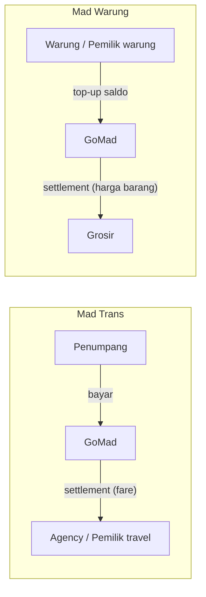

# 09 — Rantai Nilai Antar Vertical

> Menjawab agenda **Celah 2** dari `docs/06`: apa yang benar-benar menyatukan ketiga vertical?
> Status: **sebagian terjawab · satu pertanyaan kritis terbuka**

---

## 1. Yang TIDAK mengalir antar vertical

| Diuji | Hasil |
|---|---|
| Armada travel **idle** dipakai mengantar barang Mad Warung | ❌ **Tidak bisa** — hanya untuk rental & charter |
| Driver Mad Trans dipakai sebagai kurir Mad Warung | ❌ Tidak — sudah ditegaskan, driver-nya berbeda |
| Warung jadi titik serah-terima barang | ⏸️ Tidak perlu sekarang (lihat bagian 5) |

**Kesimpulan:** Mad Trans dan Mad Logistics **tidak berbagi supply**. Tidak ada aliran aset antar vertical.

---

## 2. Yang mengalir: identitas

| Relasi | Boleh? |
|---|---|
| **Penjaga warung** jadi penumpang Mad Trans | ✅ Ya |
| **Pemilik warung** jadi penumpang Mad Trans | ❌ Tidak |

> Ini contoh konkret prinsip **Unified User Identity** dari mindmap: **satu orang, banyak peran.**
> Penjaga warung hari ini memesan sembako, minggu depan naik travel — **satu akun**, tanpa registrasi ulang.

---

## 3. ⭐ Temuan struktural: pola yang berulang di semua vertical

Ini temuan terpenting dari sesi ini. Kamu menyebut *"posisi pemilik warung hampir sama dengan pemilik travel/rental"* — dan pola itu ternyata berlaku luas.

### Tiga peran yang muncul di setiap vertical

```
PEMILIK USAHA   → punya usaha · multi-unit · pegang uang · lihat semua aktivitas
      │
   STAFF        → akun sendiri · punya jadwal · dibatasi kewenangannya
      │
   PIHAK LUAR   → pelanggan atau pemasok
```

### Pemetaannya

| Vertical | Pemilik Usaha | Staff | Pihak Luar |
|---|---|---|---|
| **Mad Trans** | Pemilik travel / rental (agency) | **Driver** | Penumpang |
| **Mad Warung** | Pemilik warung | **Penjaga Warung** | **Grosir** |

Perhatikan: **Driver dan Penjaga Warung secara struktur identik.** Keduanya staff dari seorang pemilik usaha, punya akun sendiri, punya jadwal, dan aktivitasnya diawasi. Yang berbeda hanya **perannya**, bukan **polanya**.

### Peran komersial — di sinilah letak perbedaannya

| Vertical | Pemilik Usaha | Peran komersial | Arah uang |
|---|---|---|---|
| Mad Trans | Agency | **Penjual** | **Terima** settlement dari GoMad |
| Mad Warung | Pemilik warung | **Pembeli** | **Bayar** (top-up saldo) |
| Mad Warung | **Grosir** | **Penjual** | **Terima** settlement dari GoMad |

### ⭐ Konsekuensi besarnya

> **Grosir menempati posisi yang identik dengan Agency.**

Keduanya:
- Pemilik usaha yang **menjual** lewat GoMad
- **Menerima settlement** dari GoMad
- Butuh **portal** sendiri untuk mengelola pesanan
- Menjadi **pihak yang harus dibayar** GoMad

Artinya **mesin settlement Core yang dirancang untuk Mad Trans agency bisa dipakai apa adanya oleh grosir di Mad Warung.** Bukan dibangun dua kali.



**Sisi kanan diagram sama bentuknya** — hanya nama pelakunya berbeda. Inilah bentuk nyata dari "vertical business dengan Core bersama".

---

## 4. Cara grosir dibayar — **DIJAWAB**

Kalau warung membayar ke GoMad, maka **GoMad yang wajib membayar grosir**. Dan itu membuka pertanyaan yang belum pernah kita jawab:

> **Bagaimana grosir dibayar?**

| Kemungkinan | Konsekuensi |
|---|---|
| **A · GoMad yang membayar grosir** (settlement) | Grosir butuh **akun ledger + siklus settlement** — persis seperti agency. GoMad memegang uang warung sebentar |
| **B · Warung bayar langsung ke grosir** | GoMad tidak pernah memegang uang → **bagaimana GoMad menagih fee-nya?** Harus ada mekanisme tagihan terpisah |
| **C · Bayar saat serah terima** | GoMad harus hadir di momen serah terima — rumit kalau warung ambil sendiri |

**Diputuskan: Opsi A.** Grosir menerima **settlement dari GoMad**. Dan untuk tahap awal, **GoMad mem-backup pembayaran ke grosir** — sehingga grosir tidak menanggung risiko tidak dibayar.

### Konsekuensi

**1. Grosir butuh akun ledger + siklus settlement** → `GROSIR.AVAILABLE`.
Karena strukturnya identik dengan agency, **mesin settlement Core dipakai apa adanya** — tidak dibangun ulang.

**2. Kabar baik: "backup" tidak butuh modal tambahan.**
Warung sudah membayar **di muka** lewat top-up saldo. Jadi uangnya sudah ada di tangan GoMad **sebelum** barang dipesan. Mem-backup grosir sifatnya **mengatur waktu pembayaran**, bukan menyuntik dana.

> Model ini **self-funding** — tidak butuh modal kerja untuk membiayai grosir.

**3. ⚠️ Tapi itu menciptakan float — dan float punya konsekuensi regulasi.**

Selama saldo warung belum terpakai, **GoMad memegang uang milik pihak lain**. Kalau skalanya membesar, ini berpotensi masuk kategori **uang elektronik** yang diatur Bank Indonesia.

| Pilihan | Catatan |
|---|---|
| Kemitraan dengan penyedia pembayaran berlisensi | Paling aman, tapi ada biaya |
| Rekening penampungan / escrow bank | Butuh administrasi |
| Jalankan dulu dalam skala kecil, urus saat membesar | Risiko tumbuh seiring skala |

**Ini perlu dicek sebelum dibangun**, bukan setelah — karena bisa memengaruhi cara saldo disimpan.

**4. Ledger harus mendukung pembalikan.**
Karena GoMad membayar grosir lebih dulu, kegagalan (grosir tidak mengirim, warung membatalkan, barang tidak sesuai) harus bisa dibalik lewat **transaksi reversal** — bukan `update`/`delete` entri lama.

**5. Timing settlement grosir berbeda dari agency.**
Agency: mingguan (Sabtu). Grosir: kemungkinan **per pesanan atau harian** — karena "backup" berarti bayar cepat. Perlu dikonfirmasi.

**6. Titik serah-terima — DIHAPUS dari rencana.**
Tidak masuk rencana awal, tidak akan dibangun.

---

## 5. Titik serah-terima barang — apa yang saya maksud

Ini istilah yang saya sebut tanpa menjelaskan. Maksudnya:

> Sebuah **warung** dipakai sebagai **titik pengambilan** barang untuk warung-warung lain di sekitarnya.

Konsepnya sama dengan **agen/drop point** yang sudah umum: agen JNE, drop point SiCepat, atau titik pengambilan Shopee. Satu lokasi menerima kiriman sekaligus untuk beberapa penerima di sekitarnya, lalu penerima mengambil di situ. Warung yang jadi titik itu biasanya dapat komisi kecil.

**Gunanya:** menghindari pengiriman ke 10 warung terpisah — cukup kirim ke 1 titik, sisanya diambil sendiri.

**Kenapa saya tanyakan:** karena warung Madura **sudah mengelompok**, ini bisa jadi cara memperluas jangkauan Mad Logistics tanpa biaya besar.

**Tapi keputusannya: tidak perlu sekarang.** Kita sudah memutuskan pengiriman ditangani grosir atau diambil warung sendiri. Titik serah-terima baru berguna kalau Mad Logistics tumbuh — dan itu belum jadi prioritas. Saya hanya menguji apakah ide ini ada di kepalamu.

---

## 6. Ringkasan: apa yang benar-benar menyatukan GoMad

| Penyatu | Kekuatan |
|---|---|
| **GoMad Core** (identitas, ledger, settlement, notifikasi) | ⭐ Kuat — dipakai semua vertical |
| **Identitas lintas vertical** | ⭐ Kuat — penjaga warung bisa jadi penumpang |
| **Pola peran yang sama** (Pemilik Usaha · Staff · Pihak Luar) | ⭐ Kuat — satu model otorisasi untuk semua vertical |
| **Mesin settlement yang sama** (agency ⇄ grosir) | ⭐ Kuat — dibangun sekali, dipakai dua kali |
| Aliran **aset** antar vertical | ❌ Tidak ada |
| Aliran **barang** antar vertical | ❌ Tidak ada |
| Rantai sampai **konsumen akhir** | ❌ Belum masuk |

**Jawaban atas pertanyaan agenda:** GoMad bukan **satu ekosistem yang saling memberi barang**, tapi **satu platform dengan pola yang sama, diulang di tiap vertical.**

Dan itu kabar baik untuk MVP: **semakin banyak yang bisa dipakai ulang, semakin kecil yang harus dibangun.**

---

## 7. Konsekuensi ke Core

| Akun ledger | Vertical | Status |
|---|---|---|
| `AGENCY.AVAILABLE` | Mad Trans | Sudah dirancang |
| `GROSIR.AVAILABLE` | Mad Warung | ✅ **Dikonfirmasi** — grosir = agency secara struktur, pakai mesin settlement yang sama |
| ~~`WARUNG_OWNER.AVAILABLE`~~ | ~~Mad Warung~~ | ❌ **Dibatalkan** — warung tidak punya saldo, bayar via payment gateway |
| `PLATFORM.*` | Semua | Sudah dirancang |

| Komponen Core | Dipakai oleh |
|---|---|
| Ledger + hold + settlement | Mad Trans **dan** Mad Warung |
| Model otorisasi (pemilik / staff / batas) | Keduanya — plafon penjaga ≈ deposit gating agency |
| Unified User Identity | Semua vertical |
| Notification Engine | Semua vertical |
