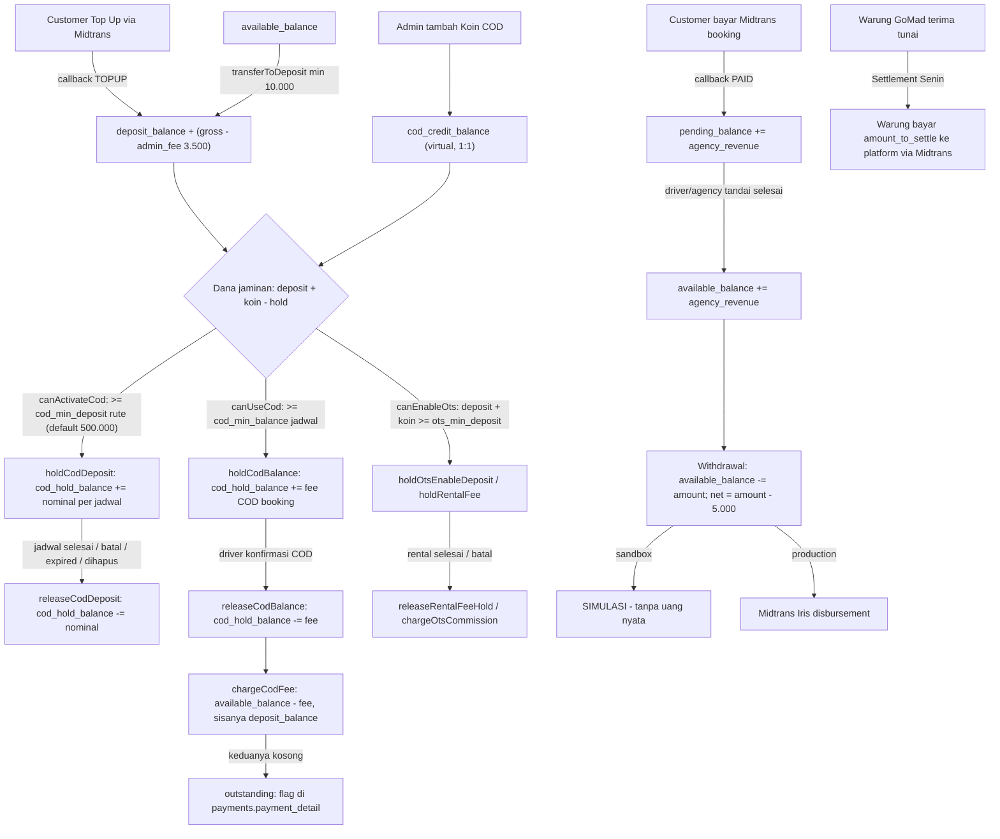

# Ekstraksi Alur Uang & Risiko — GoMad (Kode Legacy)

> **Tugas RISET.** Tidak ada kode legacy yang diubah.
> **Basis kode:** `/home/ngidengode/weweb/go-go-gomad/gomadid/` (repo di luar workspace).
> Semua sitasi `file:baris` memakai path relatif terhadap root repo legacy di atas.
> Tanggal analisis: 2026-09-28.

## Daftar file yang dibaca

Service: `WalletService.php`, `PaymentService.php`, `CashPaymentService.php`, `PaymentAgentService.php`,
`WithdrawalService.php`, `SettlementService.php`, `PricingService.php`, `PaymentMethodService.php`,
`BookingService.php`, `ScheduleService.php`, `RentalService.php`, `PassengerTransferService.php`.
Model: `AgencyWallet.php`, `WalletTransaction.php`, `AgencyPolicy.php`, `Booking.php`, `Payment.php`.
Migration: `create_wallet_transactions_table`, `create_agency_wallets_table`,
`add_cod_credit_balance_to_agency_wallets_table`, `create_settlements_table`, `create_withdrawals_table`,
`create_payments_table`, `create_cash_payments_table`, `create_payment_agents_table`,
`create_agency_policies_table`, `create_schedules_table`, `create_routes_table`.
Tambahan (call-site): `Web/Customer/BookingController`, `Web/Driver/TravelController`,
`Web/Agency/ScheduleController`, `Web/Agency/WithdrawalController`, `Web/Admin/WithdrawalController`,
`Web/Admin/CodCreditController`, `Console/Commands/ExpirePendingPayments`, `Console/Commands/GenerateWeeklySettlements`,
`Console/Kernel`, `config/gomad.php`, `database/seeders/Modules/CoreDataSeeder.php`, `routes/api.php`, `routes/web.php`.

---

## 0. Ringkasan Alur Uang



Ciri kunci yang langsung terlihat: **tidak ada ledger platform** (tidak ada akun Revenue/Tax), **`available_balance` dan `deposit_balance` adalah dua kantong berbeda yang tidak pernah saling isi secara otomatis selain lewat `transferToDeposit` manual**, dan **`cod_hold_balance` bukan pemindahan uang — hanya penghitung reservasi**.

---

## 1. Mekanika Deposit & Hold COD (PALING PENTING)

### 1.1 Peta kantong uang

`agency_wallets` — **1 dompet per agency** (`agency_id` UNIQUE), 7 kolom saldo:

| Kolom | Definisi | Bukti |
|---|---|---|
| `available_balance` | Saldo bebas, satu-satunya yang bisa ditarik | `database/migrations/2026_07_16_133122_create_agency_wallets_table.php:13`; `app/Http/Controllers/Web/Agency/WithdrawalController.php:36-41` |
| `pending_balance` | Dana sudah dibayar customer, belum dirilis ke agency | `...133122...:14`; `app/Services/WalletService.php:510-521` |
| `deposit_balance` | **Dana jaminan** (top up / transfer), tidak bisa ditarik | `...133122...:15`; `app/Services/WalletService.php:611-624` |
| `cod_hold_balance` | **Penghitung reservasi** (bukan uang keluar) | `...133122...:16`; `app/Services/WalletService.php:673-720` |
| `cod_credit_balance` | Koin COD (virtual, penambah kapasitas) | `database/migrations/2026_08_25_000004_add_cod_credit_balance_to_agency_wallets_table.php:12` |
| `total_earned` | Counter laporan | `...133122...:17` |
| `total_withdrawn` | Counter laporan | `...133122...:18` |

Rumus kapasitas COD/OTS yang dipakai konsisten di 3 tempat:

```
available_deposit = deposit_balance + cod_credit_balance - cod_hold_balance
```

- `app/Services/WalletService.php:618-624` (`getBalance`)
- `app/Services/WalletService.php:636-642` (`canActivateCod`)
- `app/Services/WalletService.php:648-654` (`canUseCod`)
- `app/Services/WalletService.php:1357-1378` (`getBalanceSummary`); duplikasi rumus di `app/Services/AgencyDashboardService.php:199`

### 1.2 Cara `deposit_balance` DIISI

Hanya ada **dua** jalur masuk (diverifikasi dengan `grep -n "deposit_balance' =>" app/Services/WalletService.php`):

1. **Top Up via Midtrans** — `app/Services/WalletService.php:1158-1262`
   - Biaya admin top up `topup_admin_fee` default **Rp 3.500** (`app/Services/WalletService.php:1130`; seed `database/seeders/Modules/CoreDataSeeder.php:40`).
   - `depositAmount = gross_amount_callback - admin_fee` (`:1228-1229`).
   - Nominal dipakai dari **payload callback Midtrans**, bukan dari order yang disimpan (`:1228`) → tidak divalidasi terhadap nominal asli order.
   - Setelah kredit: langsung `retryOutstandingFees()` (`:1258`).
2. **Transfer dari Saldo Tersedia (manual oleh agency)** — `app/Services/WalletService.php:1264-1337`
   - Minimum **Rp 10.000** (`:1266-1268`).
   - Butuh `available_balance` cukup (`:1277-1285`).
   - Menulis **2 baris ledger** sekaligus: debit `available` + credit `deposit` (`:1288-1310`).

### 1.3 Cara `cod_hold_balance` DITAMBAH (reservasi)

Semua penambahan memakai pola `cod_hold_balance += nominal` **tanpa mengurangi kantong lain**. Jadi ini *menaikkan* klaim atas deposit, bukan memindahkan uang.

| Pemicu | Nominal yang di-hold | Lokasi |
|---|---|---|
| Jadwal COD dibuat (per jadwal!) | `route.cod_min_deposit` (default **Rp 500.000**) | `app/Services/ScheduleService.php:550-567` |
| Pengajuan jadwal supir disetujui + COD | idem | `app/Services/ScheduleService.php:597-608` |
| Customer pilih COD untuk booking | **fee platform booking** = `service_fee + platform_fee` | `app/Services/WalletService.php:723-755`, dipanggil `app/Http/Controllers/Web/Customer/BookingController.php:340` |
| Rental OTS dibuat | fee platform rental (service+platform) | `app/Services/WalletService.php:288-320`, dipanggil `app/Services/RentalService.php:800` |
| OTS diaktifkan & `ots_deposit_required` | `ots_min_deposit` policy atau estimasi otomatis `fee/hari × 2` semua kendaraan | `app/Services/WalletService.php:360-424`; `app/Services/RentalService.php:556-570` |

Catatan penting: `schedule.cod_min_balance` diisi dari `route.cod_min_deposit ?? 500000` saat jadwal dibuat (`app/Services/ScheduleService.php:313-314`, `:450-451`), sementara nilai default kolom juga 500.000 (`database/migrations/2026_07_16_132916_create_schedules_table.php:35`). Untuk jadwal PP, hold **dilakukan 2×** (jadwal pergi + jadwal pulang) — `app/Services/ScheduleService.php:561-564`.

### 1.4 Cara `cod_hold_balance` DILEPAS

| Pemicu | Nominal | Lokasi | Idempotency |
|---|---|---|---|
| Driver selesaikan jadwal | `schedule.cod_min_balance` | `app/Http/Controllers/Web/Driver/TravelController.php:344-350`; `app/Http/Controllers/Api/Driver/ScheduleController.php:382-390` | **TIDAK ADA** |
| Agency hapus jadwal | `cod_min_balance` (+ PP) | `app/Http/Controllers/Web/Agency/ScheduleController.php:307-333` | **TIDAK ADA** |
| Command expire (jadwal lewat) | `cod_min_balance` | `app/Console/Commands/ExpirePendingPayments.php:60-74` | **TIDAK ADA** |
| Driver konfirmasi COD (per booking) | fee platform booking | `app/Services/WalletService.php:762-828`, dipanggil `Web/Driver/TravelController.php:466`, `Api/Driver/BookingController.php:427` | ADA (`cod_booking_release` `exists()`, `:764-773`) |
| Booking COD dibatalkan / kedaluwarsa | fee platform booking | `app/Services/WalletService.php:830-890`, dipanggil `app/Services/BookingService.php:347` | ADA via guard saldo (`:851-858`) |
| Rental OTS selesai / batal | fee platform rental | `app/Services/WalletService.php:323-358`, dipanggil `app/Services/RentalService.php:1044`, `:1155` | Tidak ada (guard: hold < fee → return) |

**Penting:** `releaseCodDeposit` HANYA menurunkan `cod_hold_balance`; **tidak** menambah `available_balance`. Ada komentar eksplisit yang menyatakan ini disengaja untuk mencegah "menciptakan uang" — `app/Services/WalletService.php:690-696`. Ini benar secara ledger, tapi artinya **deposit agency tidak pernah "kembali" ke saldo bebas; ia hanya bebas dari klaim**.

### 1.5 Apakah hold dilepas setelah jadwal selesai? — YA, tapi cacat

Ya, dilepas saat driver menekan selesai (`Web/Driver/TravelController.php:344-350`) dan juga saat jadwal dihapus/expired. Namun:

- `finish()` **tidak** men-set `is_active = false` (hanya `finished_at`, `app/Http/Controllers/Web/Driver/TravelController.php:341`).
- `gomad:expire-payments` berjalan **setiap 5 menit** (`app/Console/Kernel.php:19`) dan memilih `allow_cod = true AND cod_min_balance > 0 AND departure_date < (hari ini - 1) AND is_active = true` (`app/Console/Commands/ExpirePendingPayments.php:60-66`).
- ⇒ Jadwal yang sudah di-`finish()` (hold sudah dilepas) **akan terpilih lagi** dan `releaseCodDeposit` dipanggil **kedua kali** (tanpa cek ledger). Lihat bagian 10 nomor R1.

### 1.6 Alur langkah-demi-langkah COD (end-to-end)

1. Agency buat jadwal dengan COD aktif → `canActivateCod(agency, route.cod_min_deposit)`; gagal ⇒ exception (`app/Services/ScheduleService.php:550-561`). Lolos ⇒ `holdCodDeposit` menambah `cod_hold_balance` (`:561-564`).
2. Customer pilih COD → `PaymentMethodService::scheduleAllowsCod()` (`app/Http/Controllers/Web/Customer/BookingController.php:297-300`), lalu `minBalance = schedule.cod_min_balance ?? 500000` (`:304`) dan `canUseCod` dicek **di dalam transaksi sendiri tanpa lock** (`:307-311`).
3. Lolos ⇒ dibuat `payments` dengan `payment_type='cod'`, `status='cod_pending'`, `commission = service_fee + platform_fee`, `agency_revenue = base_price - discount` (`:326-336`); `bookings.status='confirmed'` (`:338`); `holdCodBalance(booking)` (`:340`).
4. Driver konfirmasi tunai diterima → `releaseCodBalance` (bebaskan hold fee) **lalu** `chargeCodFee` (tagih fee dari saldo) (`Web/Driver/TravelController.php:466-468`; idem `Api/Driver/BookingController.php:427-429`); `payments.status='cod_confirmed'`, `bookings.status='paid'`, `booking_passengers.cod_paid=true` (`:470-486`).
5. `chargeCodFee` menarik dari `available_balance` dulu, sisanya `deposit_balance` (`app/Services/WalletService.php:974-1015`); jika masih kurang → flag `cod_fee_outstanding` + `cod_fee_amount` di `payments.payment_detail` (`:944-955`), **tidak memblokir**.
6. Booking selesai → `releaseFunds` **dipanggil tapi langsung skip** untuk COD (`app/Services/WalletService.php:531-539`). Pendapatan fare COD **tidak pernah** masuk ledger — uang tunai ada di tangan agency/driver.
7. Tunggakan akan dicoba ditagih lagi setiap kali agency top up deposit (`app/Services/WalletService.php:1258` → `retryOutstandingFees` `:1076-1126`).

**Konsekuensi aritmetika yang perlu diperhatikan:** agency yang depositnya hanya Rp 500.000 dan mengaktifkan 1 jadwal COD akan punya `available_deposit = 500.000 + koin − 500.000 = 0`, sehingga `canUseCod` (butuh ≥ `cod_min_balance`, default 500.000) **gagal** untuk semua booking COD. Jadi secara de-facto butuh deposit ≥ 2× nominal untuk bisa menjual COD.

---

## 2. Koin COD (`cod_credit_balance`)

- **Apa itu:** "Koin COD (saldo virtual untuk hold COD)" — komentar di `app/Models/AgencyWallet.php:21`. Secara teknis: *penambah kapasitas hold* yang ikut dihitung sebagai dana jaminan. Dokumentasi kode juga menyebut "Koin ini BUKAN saldo riil, melainkan penambah kapasitas hold COD" — `app/Services/WalletService.php:1372-1375`.
- **Cara mendapat:** **hanya admin**, lewat `WalletService::addCodCredit()` (`app/Services/WalletService.php:1380-1413`), UI web `app/Http/Controllers/Web/Admin/CodCreditController.php:41-54`, API `routes/api.php:514` & `app/Http/Controllers/Api/Admin/AgencyController.php:124-155`. Tidak ada pembelian/earning oleh agency, tidak ada integrasi pembayaran.
- **Cara memakai:** tidak "dipakai" dalam arti dibelanjakan. Dampaknya hanya melalui rumus kapasitas `deposit + koin − hold` (`app/Services/WalletService.php:618-624`, `:648-654`, `:667`) dan tampilan `available_deposit` (`app/Services/AgencyDashboardService.php:199`).
- **Nilai tukar:** **TIDAK DITEMUKAN** rumus konversi/harga koin apa pun di kode. Secara efektif 1 koin = Rp 1 kapasitas hold (dipakai langsung dalam perbandingan `>=` rupiah). Tidak ada harga beli, tidak ada diskon, tidak ada expired.
- **Batasannya:**
  - Pengurangan oleh admin dibatasi: `used = max(0, cod_hold_balance - deposit_balance)`, dan `cod_credit_balance - amount` tidak boleh `< used` — `app/Services/WalletService.php:1433-1444`.
  - Tidak masuk `total_balance` (`app/Services/WalletService.php:614-615` hanya available+pending) dan **tidak bisa ditarik** (`app/Services/WithdrawalService.php:38-43` hanya cek `available_balance`).
  - Tidak pernah didebit otomatis oleh sistem (tidak ada pemakaian koin saat hold/charge) — grep `cod_credit` menunjukkan hanya `add`, `reduce` (admin), dan pembacaan saldo (`app/Services/WalletService.php:1348-1351`, `:1365`).
  - Mutasi koin disimpan di `wallet_transactions` dengan `reference_id = null` (`app/Services/WalletService.php:1404`, `:1451`) → tidak bisa direlasikan ke entitas, hanya lewat `description`.

---

## 3. Kategori Transaksi Wallet

### 3.1 Kolom `wallet_transactions`

`database/migrations/2026_07_16_133136_create_wallet_transactions_table.php:13-26`:

| Kolom | Tipe | Catatan |
|---|---|---|
| `id` | bigint PK | |
| `agency_id` | unsignedBigInteger, indexed | **tidak ada FK** (`:15`) |
| `type` | **`enum('credit','debit')`** | `:16` — hanya 2 nilai |
| `amount` | decimal(12,2) | `:17` |
| `balance_before` | decimal(12,2) | `:18` |
| `balance_after` | decimal(12,2) | `:19` |
| `description` | string nullable | `:20` (tidak diindeks) |
| `reference_type` | string(50) nullable | `:21` |
| `reference_id` | unsignedBigInteger nullable | `:22` |
| `created_at` | timestamp useCurrent | `:23`; model `public $timestamps = false` (`app/Models/WalletTransaction.php:16`) |

**Jawaban tegas: TIDAK ADA kolom kategori/jenis selain `credit`/`debit`.** Tidak ada `category`, `account`, `wallet_bucket`, `sub_type`, maupun `direction`. Model hanya mengekspos `type`, `reference_type`, `reference_id` (`app/Models/WalletTransaction.php:18-28`).

### 3.2 Bagaimana mutasi dibedakan?

Hanya lewat **`reference_type`** (diindeks bersama `reference_id` — `create_wallet_transactions_table.php:31`) plus `description` untuk manusia. Inventaris `reference_type` yang benar-benar ditulis kode:

| `reference_type` | Arti | Lokasi penulisan |
|---|---|---|
| `booking` | Rilis dana booking online | `app/Services/WalletService.php:587-596` |
| `rental_revenue` | Pendapatan rental online | `app/Services/WalletService.php:186-195` |
| `ots_commission` / `ots_commission_retry` | Tagih fee rental OTS | `app/Services/WalletService.php:1002`, `:1007`; `:1101` |
| `ots_fee_hold` / `ots_fee_release` | Hold & bebaskan fee OTS | `:313-318`; `:345-350` |
| `ots_agency_enable` / `ots_agency_release` | Jaminan enable OTS | `:414-421`; `:446-453` |
| `cod_schedule_hold` / `cod_schedule_release` | Hold & release deposit jadwal COD | `:684-689`; `:710-717` |
| `cod_booking_hold` | Hold fee booking COD | `:748-753` |
| `cod_booking_release` | Release hold fee COD (dikonfirmasi) | `:801-808` |
| `cod_booking_hold_release` | Release hold COD (batal/expired) | `:863-874` |
| `cod_fee` / `cod_fee_retry` | Tagih fee COD | `:1002`/`:1007`; `:1101` |
| `topup` | Top up deposit | `:1240-1248` |
| `transfer_to_deposit` / `transfer_from_available` | Transfer internal | `:1298-1305`; `:1307-1314` |
| `cod_credit_add` / `cod_credit_reduce` | Koin COD by admin | `:1402`; `:1451` |
| `withdrawal` / `withdrawal_refund` / `withdrawal_failed_refund` / `withdrawal_error_refund` / `withdrawal_callback_refund` | Penarikan & pengembaliannya | `app/Services/WithdrawalService.php:66-72`, `:126-132`, `:260-266`, `:281-287`, `:322-328` |

Filter riwayat yang ada hanya dua: `whereIn('reference_type', ['cod_credit_add','cod_credit_reduce'])` untuk tab "Koin COD" (`app/Services/WalletService.php:1348-1351`) dan `where('reference_type', $type)` generic (`:1344-1355`).

### 3.3 Cacat struktural pada ledger (penting untuk rebuild)

`balance_before` / `balance_after` **tidak konsisten mengacu ke kantong yang sama** per baris:

- `creditWallet`, `creditRentalRevenue`, `releaseFunds`, `debitWallet`, `transferToDeposit`(debit) → mengacu `available_balance`.
- `holdCodDeposit`, `releaseCodDeposit`, `holdCodBalance`, `releaseCodBalance`, `releaseCodHold`, `holdRentalFee`, `releaseRentalFeeHold`, `holdOtsEnableDeposit`, `releaseOtsEnableDeposit` → mengacu `cod_hold_balance`.
- `topup`, `transferToDeposit`(credit), `debitFeeWithFallback`(bagian deposit) → mengacu `deposit_balance`.
- `addCodCredit`, `reduceCodCredit` → mengacu `cod_credit_balance`.

⇒ `SUM(debit) - SUM(credit)` atas tabel ini **tidak bisa** merekonstruksi saldo mana pun. Kolom dompet juga tidak punya constraint/CHECK, dan tidak ada trigger rekonsiliasi.

---

## 4. Rumus Fee & Pajak

### 4.1 Model B (model aktif) — `app/Services/PricingService.php:44-102`

```
agency_net        = max(0, base_price_or_subtotal - discount_amount)        # :108-114
fees_income       = max(0, service_fee + platform_fee)                     # :108-114
agent_commission  = 0                                  (non-cash)
                  = total_price × warung_commission_rate%   (cash)         # :58-60, rate :46
platform_commission = max(0, total_price - agency_net - agent_commission)  # :63
agency_revenue    = agency_net                                             # :53-56
```

- `warung_commission_rate` default **2%** (`app/Services/PricingService.php:46`; `config/gomad.php:52`; juga `payment_agents.commission_rate` default 2.00 — `database/migrations/2026_07_16_133108_create_payment_agents_table.php:37`).
- **`service_fee` dan `platform_fee` TIDAK PERNAH dihitung di service** — nilainya datang dari `bookings`/`rentals` (diisi di luar file yang ditugaskan). Di `PricingService` ia hanya dibaca sebagai input. ⇒ **TIDAK DITEMUKAN** rumus penetapan besaran service/platform fee per booking.
- `commission_rate` **5%** hanya dipakai di fallback `LEGACY` (`app/Services/PricingService.php:64-96`; `config/gomad.php:51`) yang menurut komentar di `:62-63` "harusnya tidak dipakai". Semua pemanggil produksi sudah mengirim `agencyNet + feesIncome` (`app/Services/PaymentService.php:32-38`, `:119-124`, `:357-363`; `app/Services/CashPaymentService.php:40-45`; `app/Http/Controllers/Web/Customer/BookingController.php:326-334`; `app/Services/RentalService.php:786-795`).
- `agency_policies.commission_override` **terdefinisi tapi tidak dipakai** — hanya dibaca oleh `AgencyPolicy::effectiveCommission()` (`app/Models/AgencyPolicy.php:118-121`) yang **tidak punya pemanggil** (grep `effectiveCommission` → hanya definisi).
- Estimasi fee rental OTS memakai **hardcode 3%**: `rentalDayFeeEstimate = (price_per_day + driver_fee_per_day) × 0.03` (`app/Services/WalletService.php:360-366`) — berbeda basis dari `service_fee + platform_fee`. Nilai ini hanya dipakai untuk menghitung **nominal hold jaminan** (`:370-394`), bukan tagihan final.

### 4.2 Fee penarikan & top up

- Top up: admin fee **Rp 3.500** (`app/Services/WalletService.php:1130`; seed `database/seeders/Modules/CoreDataSeeder.php:40`).
- Withdrawal: admin fee **Rp 5.000** (`app/Services/WithdrawalService.php:30`; seed `:38`; default kolom `withdrawals.admin_fee` 5000 — `database/migrations/2026_07_16_133340_create_withdrawals_table.php:17`).

### 4.3 Pajak / PPN / PPh

**TIDAK DITEMUKAN.** Bukti:

- `grep -rniE "ppn|pajak|tax|vat"` pada `app/ config/ database/ routes/ resources/` hanya menghasilkan kecocokan palsu (`avatar`, `private readonly`, dst.) — tidak ada satu pun perhitungan pajak.
- Tidak ada kolom pajak di `payments`, `cash_payments`, `settlements`, `withdrawals`, `wallet_transactions`, `agency_wallets` (migration terkait, lihat daftar file yang dibaca).
- Tidak ada nilai konfigurasi pajak di `config/gomad.php` (bagian Commission hanya `commission_rate` & `warung_commission_rate`, `:49-53`).
- Payload Midtrans booking memakai item `TKT-`, `FEE-`, `PLT-`, `DSC-`, `ADJ-` tanpa baris pajak (`app/Services/PaymentService.php:150-215`).

⇒ Termasuk temuan keputusan D3 di catatan repo (PPN 11% dari total komisi) yang **sama sekali belum ada di legacy**.

---

## 5. Alur Settlement

Settlement di sini adalah **Warung GoMad (payment agent) menyetor ke platform**, bukan platform membayar warung.

- **Kapan dijalankan:** command `gomad:generate-settlements` → `weeklyOn(1, '00:01')` (Senin 00:01) — `app/Console/Kernel.php:25`. Command juga memanggil `markOverdueSettlements()` **sebelum** generate (`app/Console/Commands/GenerateWeeklySettlements.php:26-29`). Ada guard internal: jika bukan Senin, generate dilewati (`app/Services/SettlementService.php:30-33`).
- **Basis periode:** `periodEnd = startOfWeek(MONDAY) - 1 hari` (Minggu sebelumnya), `periodStart = periodEnd - 6 hari` ⇒ periode **Senin–Minggu minggu sebelumnya** (7 hari) — `app/Services/SettlementService.php:27-28`.
- **Populasi:** agent `is_active = true AND is_verified = true` (`:38`); lalu per agent, `cash_payments` dengan `status='confirmed'`, `settlement_id IS NULL`, `confirmed_at BETWEEN periodStart(startOfDay)..periodEnd(endOfDay)`, di-`lockForUpdate()` (`:66-73`). Jika kosong → tidak dibuat settlement (`:75-78`).
- **Rumus `amount_to_settle`:**

```
total_amount      = SUM(cash_payments.amount)             # :80
total_commission  = SUM(cash_payments.agent_commission)   # :81
amount_to_settle  = total_amount - total_commission       # :83
```
  dengan `agent_commission` yang di-increment saat konfirmasi = `total_price × 2%` (`app/Services/CashPaymentService.php:53`, `:131-132`). Jika `amount_to_settle <= 0` → settlement dibatalkan (`app/Services/SettlementService.php:86-92`).
- **Status & transisi** (enum `app/Enums/SettlementStatus.php:9-12`; kolom enum di `database/migrations/2026_07_16_133356_create_settlements_table.php:24`):

| Transisi | Pemicu | Bukti |
|---|---|---|
| → `pending` (default) | generate mingguan | `app/Services/SettlementService.php:101-102` |
| → `overdue` | pending dengan `created_at < now-7d`, di-set di command | `:316-323` |
| `pending` → `paid` | warung bayar via Midtrans Snap (`paySettlement`, gross = `amount_to_settle`) dan callback `capture/settlement` + `fraud_status=accept` | `:131-193`, `:250-262` |
| `paid` → `verified` | admin `verifySettlement` | `:282-295`; UI `app/Http/Controllers/Web/Admin/SettlementController.php:36` |

- Efek samping saat generate: `cash_payments.status='settled'`, `settlement_id` diisi, `settled_at` (`:107-111`); `payment_agents.balance_to_settle -= amount_to_settle` (dengan `max(0,…)`) & `last_settlement_at` (`:115-119`).
- Idempotency generate: ada — cek settlement existing untuk `(agent, period_start, period_end)` sebelum membuat (`:50-61`).
- **TIDAK DITEMUKAN:** penalti/denda keterlambatan (`overdue` hanya label), rekonsiliasi tunai vs transfer, dan pemotongan pajak pada settlement.

---

## 6. Alur Pencairan (Withdrawal)

- **Minimum:** `minimal_withdrawal` default **Rp 100.000** — `app/Services/WithdrawalService.php:29`, `:34-40`; seed `database/seeders/Modules/CoreDataSeeder.php:37`; juga validasi request `min:` di `app/Http/Controllers/Web/Agency/WithdrawalController.php:34`.
- **Biaya admin:** `withdrawal_admin_fee` default **Rp 5.000** (`app/Services/WithdrawalService.php:30`); `net_amount = amount - admin_fee` (`:46`) dan wajib `> 0` (`:48-50`).
- **Sumber dana:** hanya `available_balance` (`:38-43`). Deposit & koin COD **tidak bisa ditarik**.
- **Ambang auto-approve:** `auto_approve_limit` default **Rp 5.000.000**; `amount < limit` ⇒ langsung `APPROVED` lalu `PROCESSING` + dispatch disbursement; `>= limit` ⇒ `PENDING` menunggu admin (`:52-53`, `:74-88`).
- **Siapa menyetujui:** admin — `app/Http/Controllers/Web/Admin/WithdrawalController.php:33-39` (web) dan `app/Http/Controllers/Api/Admin/WithdrawalController.php:61` (API). Menolak: `:41-52` / `:86`.
- **Uang didebit saat pembuatan, bukan saat approve:** `debitWallet` dipanggil di dalam `createWithdrawal` (`app/Services/WithdrawalService.php:66-73`) — jadi selama status `pending`, saldo sudah berkurang. Jika ditolak → dikembalikan penuh termasuk admin fee (`creditWallet(withdrawal->amount)`, `:126-132`).
- **Transisi status** (`app/Enums/WithdrawalStatus.php:9-14`): `pending → approved → processing → completed` (atau `failed`), `pending → rejected`. `approved` hanya status antara (langsung ditimpa `processing`, `:100-104`).
- **Apakah benar-benar memindahkan uang?** Dua mode:
  - **Sandbox (default, `MIDTRANS_IS_PRODUCTION=false`)** → benar-benar **SIMULASI**: tidak memanggil API, langsung `COMPLETED` dengan `transaction_id = 'SIM-{id}-{time}'` dan `payment_detail.mode='sandbox_simulation'` (`app/Services/WithdrawalService.php:142-183`).
  - **Production** → Midtrans Iris: buat beneficiary lalu payout, `Idempotency-Key: withdrawal-{id}-{time}` (`:186-270`). Catatan: header Idempotency-Key memuat `time()` sehingga **selalu berubah** ⇒ idempotency Midtrans tidak akan pernah aktif (`:214-220`).
- **Webhook disbursement:** `POST /api/.../midtrans/disbursement-callback` (`routes/api.php:161-162`) → `app/Services/WithdrawalService.php:293-333`. Callback ini **tidak diverifikasi signature** dan **tidak mengecek status withdrawal saat ini** sebelum mengembalikan dana (`:316-331`).

---

## 7. Idempotency Callback Pembayaran

| Callback | Signature diverifikasi? | Guard duplikat | Cek nominal? | Lokasi |
|---|---|---|---|---|
| Booking (order_id = `booking_code-time`) | **YA** — SHA-512(`order_id+status_code+gross_amount+server_key`) dengan `hash_equals` | **YA** — bandingkan `payment_detail.last_callback_status` + `last_callback_fraud`; lalu tolak jika status sudah final (`paid/failed/refunded/expired`) | **TIDAK** | `app/Services/PaymentService.php:429`, `:618-631`, `:481-490`, `:493-507` |
| TOPUP (order_id `TOPUP-{agency}-{time}`) | YA (lewat handler yang sama) | **YA (rapuh)** — cek `wallet_transactions` `reference_type='topup'` AND `description LIKE '%order_id%'` (karena `reference_id` integer tidak dipakai) | Tidak (nominal dari payload, `:1228`) | `app/Services/WalletService.php:1172-1183` |
| Rental (order_id `RNTL-{id}-{time}`) | YA (lewat handler yang sama) | **TIDAK ADA** — tidak ada cek status/flag; `update` diulang tiap callback | Tidak | `app/Services/PaymentService.php:576-616` |
| Settlement (order_id `STL-{id}-{time}`) | YA (lewat handler yang sama) | **YA** — `last_callback_status` + tolak bila status sudah `paid/verified` | Tidak | `app/Services/SettlementService.php:233-247`, `:238-246` |
| Disbursement withdrawal | **TIDAK ADA verifikasi signature** | **TIDAK ADA** | Tidak | `app/Services/WithdrawalService.php:293-333` |

Catatan tambahan:

- Routing callback: `handleMidtransCallback` memilih handler berdasarkan prefix `TOPUP-` / `RNTL-` / `STL-`, sisanya dianggap booking (`app/Services/PaymentService.php:444-470`).
- Guard booking hanya bekerja bila `payment` ada (`:479` mengakses `$payment->payment_detail` tanpa null-check) — bila booking tanpa payment, akan error, bukan diproses dobel.
- Guard TOPUP berbasis `LIKE '%TOPUP-5-1727...%'` pada kolom `description` (string) — bila order id dipotong/berubah format, guard gagal senyap.
- Tidak ada perlindungan replay di level HTTP (tidak ada unique index pada `payments.transaction_id`; kolom hanya `index()` — `database/migrations/2026_07_16_133030_create_payments_table.php:29`), dan tidak ada tabel `webhook_events`.

---

## 8. Refund

### 8.1 Refund booking (travel)

- **Siapa yang memicu:** customer membatalkan booking (`app/Services/BookingService.php:275` → `cancelBooking`), dengan syarat `Booking::canCancel` (pending/confirmed boleh; `paid` hanya bila >24 jam sebelum keberangkatan) — `app/Models/Booking.php:92-118`, `:113-116`.
- **Potongan:** `cancellation_fee = round(total_price × 0.25)` (**25%**) dan `cancellation_refund = total_price - cancellation_fee` — `app/Models/Booking.php:124-133`, `:136-143`.
- **Eksekusi:** hanya untuk `payment_type = 'midtrans'` dan status lama `paid`, memanggil `PaymentService::refundPayment(booking, cancellation_refund)` — `app/Services/BookingService.php:320-329`. Status lain: Midtrans non-paid → `expired`; cash confirmed → `cash_payments.status = 'refund_pending'`; COD pending → `releaseCodHold` + payment `expired` — `:330-352`.
- **Dari saldo mana diambil?** **Bukan dari dompet agency.** Refund memanggil API Midtrans `/v2/{transaction_id}/refund` (`app/Services/PaymentService.php:735-741`) sehingga dana keluar dari saldo Midtrans platform. Dompet agency hanya **dikurangi `pending_balance`** sebesar `agency_revenue` (`app/Services/BookingService.php:362-369`). `available_balance` tidak disentuh ⇒ jika dana sudah dirilis ke available sebelum cancel, agency tetap pegang uangnya.
- **Mode simulasi:** bila `midtrans.server_key` kosong → `simulateRefund` hanya menandai `REFUNDED` + `payment_detail.refund.mode='simulation'` (`app/Services/PaymentService.php:713-715`, `:807-825`). Jika API gagal/exception → status tetap di-set `REFUNDED` dengan `needs_manual_refund = true` (`:764-804`).
- **Approval refund:** `approveRefund` (`:828-856`) dan `rejectRefund` (`:858-882`) mensyaratkan status `REFUND_PENDING`. **Tidak ada kode mana pun yang men-set `REFUND_PENDING`** untuk booking (grep `REFUND_PENDING` hanya menemukan enum + pengecekan di `PaymentService`), dan accessor `Booking::needsRefundApproval()` (`app/Models/Booking.php:148-160`) tidak dipakai di mana pun ⇒ **alur approval refund booking praktis tidak terjangkau (dead code)**; route tetap ada: `routes/web.php:425`.
- **Refund rental:** potongan sama 25% (`app/Services/RentalService.php:1125-1126`), dieksekusi `refundPaymentForRental` (`app/Services/PaymentService.php:885+`), lalu `pending_balance` agency dikurangi `agency_revenue` (`app/Services/RentalService.php:1164-1170`). Untuk OTS yang belum dibayar → hanya `releaseRentalFeeHold` (`:1153-1157`).
- **Refund cash (Warung):** status `refund_pending` di-set (`app/Services/BookingService.php:336`; `app/Services/RentalService.php:1147-1151`) tapi **TIDAK DITEMUKAN** pemrosesnya — tidak ada controller/command yang menyelesaikan refund cash.
- **Transfer penumpang:** tidak ada biaya transfer antar agent (`transferFee = 0`, `app/Services/PassengerTransferService.php:183-186`); perpindahan dana antar agency dilakukan dengan adjust `pending_balance` pengirim & penerima (`:447-495`).

---

## 9. Antisipasi Saldo Negatif / Race Condition

### 9.1 Yang sudah dijaga

- `DB::transaction` + `lockForUpdate` pada: `creditWallet` (`app/Services/WalletService.php:46-58`, plus retry deadlock 3× dengan backoff `:77-113`), `creditRentalRevenue` (`:159`), `chargeOtsCommission` (`:231`), `releaseRentalFeeHold` (`:332`), `releaseOtsEnableDeposit` (`:438`), `debitWallet` (`:464`), `releaseFunds` (`:568`), `releaseCodBalance` (`:782`), `releaseCodHold` (`:835`), `chargeCodFee` (`:913`), `retryOutstandingFees` (`:1089`), `processTopUpCallback` (`:1215`, tapi lihat 9.2), `transferToDeposit` (`:1273`), `addCodCredit` (`:1387`), `reduceCodCredit` (`:1422`).
- **Cek saldo sebelum debit (hard block):** `debitWallet` melempar exception jika `available_balance < amount` (`app/Services/WalletService.php:474-481`) — dipakai untuk withdrawal & refund withdrawal.
- **Debit fee tidak boleh minus:** `debitFeeWithFallback` memakai `min(saldo, sisa)` sehingga saldo berhenti di 0 dan sisanya jadi tunggakan (`:974-1015`).
- **Kunci pada entitas bisnis:** `cash_payments` di-`lockForUpdate` saat konfirmasi (`app/Services/CashPaymentService.php:97`), `Settlement` & `CashPayment` di-lock saat generate (`app/Services/SettlementService.php:53`, `:72`), booking di-lock saat create (`app/Services/BookingService.php:37`), rental & konflik jadwal di-lock (`app/Services/RentalService.php:526`, `:597`, `:612`).

### 9.2 Yang TIDAK dijaga (baca-baca-modif-tulis tanpa lock)

| Fungsi | Masalah | Lokasi |
|---|---|---|
| `addPendingBalance` | `getOrCreateWallet` tanpa lock → lost update `pending_balance` | `app/Services/WalletService.php:510-521` |
| `holdCodDeposit` | tanpa lock saat `+= cod_hold_balance` | `:673-690` |
| `releaseCodDeposit` | tanpa lock; **tanpa idempotency** → bisa release berkali-kali | `:698-720` |
| `holdCodBalance` | tanpa lock (hold booking COD) | `:732-755` |
| `releaseCodHold` | lock ada, tapi guard-nya hanya "hold < nominal → return" | `:830-890` |
| `holdRentalFee` | tanpa lock | `:298-320` |
| `holdOtsEnableDeposit` | tanpa lock (ada idempotency `exists()`) | `:397-424` |
| `processTopUpCallback` | memakai `lockForUpdate` **namun tidak dibungkus `DB::transaction`** ⇒ lock efektif tidak berlaku (autocommit); kredit deposit rawan race | `:1158-1262` (`:1213-1216`) |
| `BookingService::cancelBooking` (adjust `pending_balance`) | tanpa lock | `app/Services/BookingService.php:362-369` |
| `RentalService::cancelRental` (adjust `pending_balance`) | tanpa lock | `app/Services/RentalService.php:1164-1170` |
| `PassengerTransferService::adjustWalletForTransfer` | tidak ada `lockForUpdate` di seluruh file (tidak muncul di grep lock) | `app/Services/PassengerTransferService.php:447-495` |
| Gating COD (`processCod`) | `canUseCod` dicek di transaksi **terpisah & tanpa lock**, lalu `holdCodBalance` di transaksi berikutnya ⇒ TOCTOU: dua booking COD bersamaan bisa sama-sama lolos melebihi kapasitas deposit | `app/Http/Controllers/Web/Customer/BookingController.php:307-311`, `:323-341` |
| `WithdrawalService::approveWithdrawal` | cek `status === pending` lalu update, **tanpa lock** ⇒ dua approve bersamaan bisa memicu dua disbursement | `app/Services/WithdrawalService.php:92-104` |
| `handleDisbursementCallback` | tanpa verifikasi signature, tanpa cek status ⇒ callback `failed` berulang = pengembalian dana berulang | `:293-333` |
| `releaseFunds` | `pending_balance` dikurangi dengan `max(0, …)`; jika pending sudah 0, `available_balance` **tetap** ditambah penuh ⇒ potensi penciptaan uang bila guard idempotency gagal | `app/Services/WalletService.php:577-601` |

- **Tidak ada proteksi level database:** tidak ada `CHECK (x >= 0)` pada `agency_wallets`, tidak ada `unique` pada `withdrawals`/`payments` untuk mencegah dobel, dan tidak ada kolom versi/optimistic lock.
- **`total_earned` naik saat refund withdrawal** karena `creditWallet` selalu menambah `total_earned` (`app/Services/WalletService.php:68-71`) — dipakai juga untuk `withdrawal_refund`, `withdrawal_failed_refund`, `withdrawal_error_refund`, `withdrawal_callback_refund` ⇒ counter pendapatan jadi tidak akurat.

---

## 10. Daftar Hal Ambigu / Berisiko / Tidak Konsisten

Diurutkan dari yang paling berisiko finansial.

| # | Severity | Temuan | Bukti |
|---|---|---|---|
| R1 | **Tinggi** | **Double release hold deposit jadwal COD.** `finish()` tidak men-set `is_active=false`; command expire (jalan tiap 5 menit) memilih `is_active=true AND departure_date < kemarin` tanpa cek apakah hold sudah pernah dilepas ⇒ `releaseCodDeposit` dapat jalan berkali-kali (hold bisa turun di bawah klaim riil). `destroy()` juga melepas lagi tanpa cek. | `app/Http/Controllers/Web/Driver/TravelController.php:341-350`; `app/Console/Commands/ExpirePendingPayments.php:60-74`; `app/Http/Controllers/Web/Agency/ScheduleController.php:307-333`; `app/Services/WalletService.php:698-720` |
| R2 | **Tinggi** | **Callback disbursement withdrawal tanpa signature & tanpa cek status** ⇒ pengembalian dana bisa terjadi berulang. | `app/Services/WithdrawalService.php:293-333`; `routes/api.php:161` |
| R3 | **Tinggi** | **Komentar vs kode bertabrakan soal pendapatan COD.** `releaseFunds` menyatakan "Pendapatan COD … dikredit SEKALI di `releaseCodBalance()`", padahal `releaseCodBalance` **tidak mengkredit apa pun** (hanya melepas hold). Tidak ada kredit fare COD di ledger mana pun ⇒ akuntansi pendapatan agency untuk COD tidak pernah tercatat. | `app/Services/WalletService.php:523-536` vs `:762-828` |
| R4 | **Tinggi** | **Tunggakan (outstanding) hanya hidup di JSON** `payments.payment_detail` dan hanya di-retry saat top up deposit. Tidak ada tabel piutang, tidak ada aging, tidak ada blokir layanan. | `app/Services/WalletService.php:944-955`, `:1017-1063`, `:1258` |
| R5 | **Tinggi** | **Tidak ada PPN/pajak sama sekali** meski keputusan D3 mensyaratkan PPN 11% dari total komisi + pemisahan akun Revenue vs Tax Payable. Juga **tidak ada akun/ledger untuk pendapatan platform**. | Bukti negatif pada §4.3; `app/Services/WalletService.php` (tidak ada ledger platform) |
| R6 | **Tinggi** | **`balance_before`/`balance_after` mengacu ke kantong berbeda** per baris ledger (available/deposit/hold/koin) ⇒ ledger tidak dapat direkonsiliasi, tidak ada penanda akun. | §3.3; `database/migrations/2026_07_16_133136_create_wallet_transactions_table.php:13-26` |
| R7 | **Sedang–Tinggi** | **`agency_policies` banyak kolom mati:** `cod_daily_limit`, `cod_max_per_booking`, `allow_cod_without_deposit`, `credit_limit`, `commission_override`, `settlement_schedule` hanya bisa diisi admin/divalidasi form, **tidak pernah dibaca logika bisnis**. Khususnya `AgencyPolicy::canUseCod()` (yang memuat aturan "COD tanpa deposit") **tidak punya pemanggil**; gate riil memakai `WalletService::canUseCod`. | `database/migrations/2026_08_18_110000_create_agency_policies_table.php:14-32`; `app/Models/AgencyPolicy.php:86-121`; `app/Http/Controllers/Web/Admin/AgencyPolicyController.php:47-56` |
| R8 | **Sedang–Tinggi** | **Basis aturan COD tidak konsisten:** gate memakai `schedule.cod_min_balance` (`:304`) sedangkan hold memakai `route.cod_min_deposit` (`app/Services/ScheduleService.php:554`). Nilainya kebetulan sama saat pembuatan jadwal (`:313-314`), tapi **berubah jika admin mengubah rute setelah jadwal dibuat** — sedangkan `releaseCodDeposit` memakai `schedule.cod_min_balance` (basis baru) ⇒ hold/release tidak simetris. | `app/Http/Controllers/Web/Customer/BookingController.php:304`; `app/Services/ScheduleService.php:313-314`, `:550-564`; `app/Console/Commands/ExpirePendingPayments.php:67-71` |
| R9 | **Sedang** | **Refund booking melebihi yang tersedia di pending.** `cancellation_refund` = 100% − 25% (75% dari total), sedangkan `pending_balance` hanya berisi `agency_revenue` (= total − fee). Sisa (75% × total − agency_revenue) dibayar Midtrans dari saldo platform, bukan dari agency ⇒ platform bisa menanggung selisih, dan agency tidak dikenai potongan. | `app/Models/Booking.php:136-143`; `app/Services/BookingService.php:320-329`, `:362-369` |
| R10 | **Sedang** | **Alur approval refund booking dead code** (`REFUND_PENDING` tidak pernah di-set; `needsRefundApproval` tidak dipakai) padahal route admin tersedia. | `app/Services/PaymentService.php:828-882`; `app/Models/Booking.php:148-160`; `routes/web.php:425` |
| R11 | **Sedang** | **Refund cash (Warung) tidak punya eksekutor** — `cash_payments.status='refund_pending'` di-set tapi tidak ada proses lanjutan. | `app/Services/BookingService.php:336`; `app/Services/RentalService.php:1147-1151` |
| R12 | **Sedang** | **`Idempotency-Key` disbursement memuat `time()`** ⇒ nilainya selalu berbeda; kunci idempotency Midtrans tidak pernah efektif. | `app/Services/WithdrawalService.php:214-220` |
| R13 | **Sedang** | **Nominal TOPUP diambil dari payload callback**, tidak diverifikasi terhadap order/nominal yang disimpan; guard duplikat berbasis `description LIKE` pada string (rapuh). Ditambah `lockForUpdate` di luar transaksi di path yang sama. | `app/Services/WalletService.php:1172-1183`, `:1213-1216`, `:1228-1229` |
| R14 | **Sedang** | **Callback rental tidak punya guard idempotency/status** dan tidak memverifikasi `gross_amount` vs `payments.amount`; begitu juga callback booking tidak membandingkan nominal. | `app/Services/PaymentService.php:576-616`, `:529-546` |
| R15 | **Sedang** | **TOCTOU pada gating COD**: cek kapasitas tanpa lock di transaksi terpisah dari hold ⇒ kapasitas deposit bisa terlampaui. | `app/Http/Controllers/Web/Customer/BookingController.php:307-311` vs `:323-341` |
| R16 | **Sedang** | **Agency bisa "pecah" deposit tanpa jejak dana nyata:** `holdCodDeposit` hanya menaikkan counter, sehingga menjual banyak jadwal COD menaikkan `cod_hold_balance` dan menurunkan `available_deposit`; agency bisa terjebak "saldo mengendap" tanpa cara menariknya kembali kecuali lewat `releaseCodDeposit` (yang tidak menambah `available_balance`) dan `withdrawals` tidak menyentuh deposit. Keputusan D1 (deposit gating) belum punya mekanisme keluar. | `app/Services/WalletService.php:673-720`; `app/Services/WithdrawalService.php:38-43` |
| R17 | **Sedang** | **Fee `service_fee`/`platform_fee` tidak punya rumus di service** (hanya dibaca). Estimasi fee rental memakai hardcode 3% yang berbeda basis ⇒ dua sumber kebenaran fee. | `app/Services/PricingService.php:44-102`; `app/Services/WalletService.php:360-366` |
| R18 | **Rendah–Sedang** | **`commission_rate` 5% masih hidup sebagai fallback LEGACY**; kalau ada pemanggil lama, potongan agency 5% dari total bisa muncul tanpa disadari. | `app/Services/PricingService.php:64-96`; `config/gomad.php:51` |
| R19 | **Rendah–Sedang** | **`total_earned` ikut naik pada setiap pengembalian dana withdrawal** (karena `creditWallet` selalu menambah `total_earned`) ⇒ laporan pendapatan tidak akurat. | `app/Services/WalletService.php:68-71`; `app/Services/WithdrawalService.php:126-132`, `:260-266`, `:281-287`, `:322-328` |
| R20 | **Rendah** | **Koin COD tidak punya harga, masa berlaku, atau audit selain `description`; `reference_id = null`** ⇒ sulit ditelusuri; tidak pernah terpakai otomatis. | `app/Services/WalletService.php:1402`, `:1451` |
| R21 | **Rendah** | **Nama `type` menyesatkan:** baris `type='debit'` ditulis untuk `cod_hold_balance += x` (menambah hold) dan `type='credit'` untuk mengurangi hold (`releaseCodDeposit`) — semantik debit/credit terbalik dari intuisi akuntansi pada kolom non-`available`. | `app/Services/WalletService.php:683-689` vs `:708-717` |
| R22 | **Rendah** | **`settlements` tidak punya status `failed`** meski `handleSettlementCallback` menangani status gagal (hanya mencatat di `payment_detail`) ⇒ settlement gagal tetap `pending` hingga jadi `overdue`. | `database/migrations/2026_07_16_133356_create_settlements_table.php:24`; `app/Services/SettlementService.php:265-278` |
| R23 | **Rendah** | **`AgencyWallet::transactions()`** memakai `hasMany(..., 'agency_id', 'agency_id')` (foreign key = `agency_id`, bukan `wallet.id`) — sengaja, tapi berarti `wallet_transactions` tidak bisa dikaitkan ke baris dompet tertentu. | `app/Models/AgencyWallet.php:44-47` |
| R24 | **Rendah** | **`ExpirePendingPayments` melepas hold COD untuk jadwal yang belum tentu pernah mendapat hold** (mis. `allow_cod` diaktifkan belakangan), sehingga bisa mengurangi `cod_hold_balance` milik jadwal/booking lain yang masih aktif (pool `cod_hold_balance` dicampur satu kolom). | `app/Console/Commands/ExpirePendingPayments.php:60-74`; `database/migrations/2026_07_16_133122_create_agency_wallets_table.php:16` |
| R25 | **Rendah** | **Tidak ada pemisahan pool hold:** hold jadwal COD, hold booking COD, hold fee OTS, dan hold enable-OTS semuanya menumpuk di satu kolom `cod_hold_balance` tanpa rincian per referensi ⇒ mustahil memverifikasi hold mana yang belum dilepas. | `app/Services/WalletService.php:673-890` |

### Hal yang secara eksplisit TIDAK DITEMUKAN

1. Perhitungan **PPN/pajak** dalam bentuk apa pun (§4.3).
2. Kolom **kategori/jenis transaksi** selain `type` enum credit/debit pada `wallet_transactions` (§3.1).
3. **Ledger/dompet platform** (Revenue, Tax Payable, Escrow) — hanya tabel `payments.commission` & admin fee sebagai catatan implisit.
4. **Ledger driver / pemilik armada** — driver tidak punya saldo; uang tunai COD & fare fisik di luar sistem.
5. **Penarikan `deposit_balance`** (deposit tidak bisa ditarik, tidak ada refund deposit).
6. **Rumus penetapan `service_fee` / `platform_fee`** di dalam service (§4.1).
7. **Pemrosesan refund tunai Warung** (`refund_pending` tanpa eksekutor) (§8.1).
8. **Verifikasi signature pada callback disbursement** (§7, §9.2).
9. **Penalti/denda settlement terlambat**, rekonsiliasi setoran tunai, dan **pemotongan pajak pada settlement** (§5).
10. **Histori/kategori pemakaian Koin COD** selain baris tambah/kurang oleh admin (§2).
11. **Constraint database** (CHECK saldo ≥ 0, unique transaksi webhook, foreign key `wallet_transactions.agency_id`) (§9.2).
