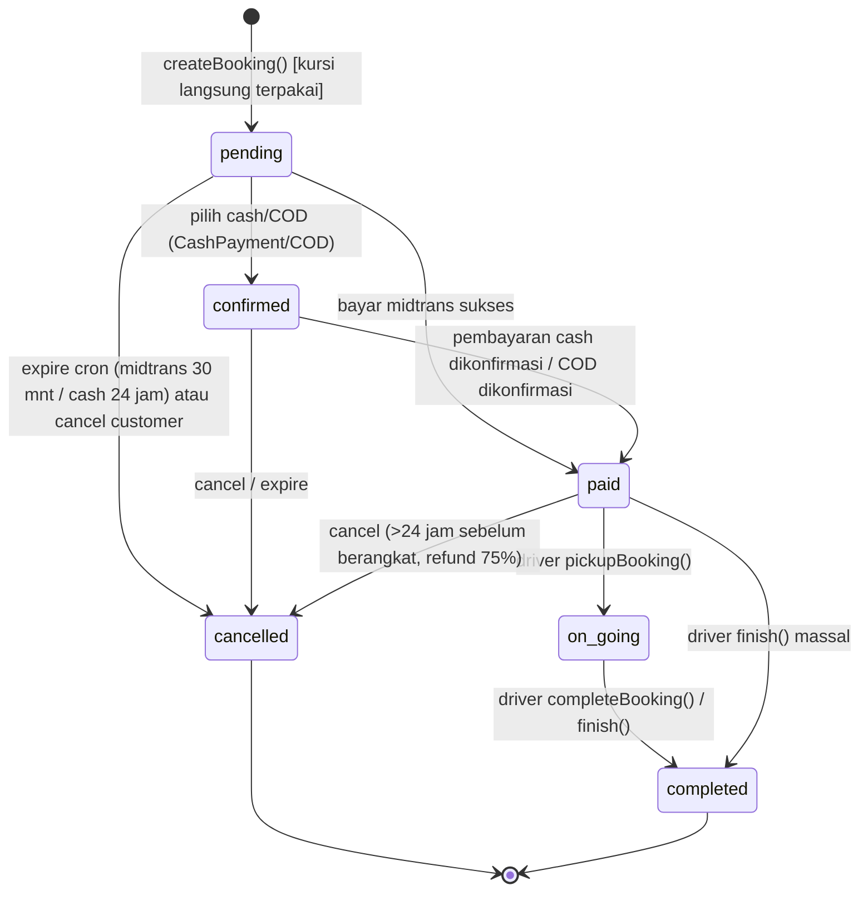
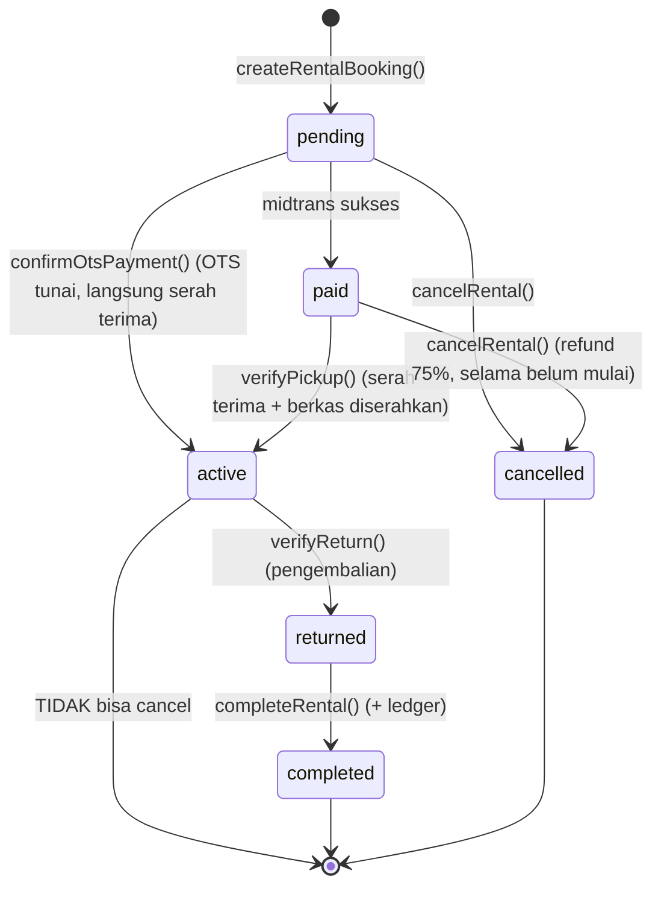

# Ekstraksi Siklus Booking — Legacy GoMad (Laravel)

> **Sumber:** repo `/home/ngidengode/weweb/go-go-gomad/gomadid/` (di luar workspace).
> **Sifat:** RISET saja — tidak ada kode yang diubah.
> **Format sitasi:** `path/relatif/ke/gomadid/file.php:baris`. Semua baris merujuk pada kondisi repo saat ekstraksi.
> **Konvensi:** hal yang tidak ada di kode ditulis eksplisit **TIDAK DITEMUKAN** (tidak diterka).

Repositori tidak menyimpan `max_transfer_fee_percent`/`transfer_fee_per_passenger` yang berfungsi, tidak punya TTL kunci kursi eksplisit, dan tidak punya cutoff penjualan. Detail di bawah.

---

## 0. Ringkasan Siklus Hidup

### 0.1 Jadwal (Schedule) — approval + trip start/finish

```mermaid
stateDiagram-v2
    [*] --> Draft: agency createSchedule
    [*] --> Pending: driver createSchedule(proposedBy)
    Draft --> Approved: is_active=true, approval_status=approved
    Pending --> Approved: approveProposal() (agency) + hold COD deposit
    Pending --> Rejected: rejectProposal() (agency)
    Rejected --> [*]
    Approved --> Berjalan: started_at diisi (agency: hanya H-0; driver: kapan saja setelah approved)
    Berjalan --> Selesai: finished_at diisi (driver finish) + booking completed + release COD hold
    Selesai --> [*]
```

Catatan: `approval_status` dan `started_at`/`finished_at` **bukan enum**, hanya string/kolom datetime (`app/Models/Schedule.php:78-84`).

### 0.2 Booking (tiket travel)

Transisi legal didefinisikan di `app/Enums/BookingStatus.php:9-14` dan `:43-48`.

### 0.3 Rental

Transisi legal: `app/Enums/RentalStatus.php:7-12` dan `:41-45`; status default `pending` di `database/migrations/2026_07_16_133444_create_rentals_table.php:44`.

---

## 1. Kunci Kursi / Kapasitas

### 1.1 Cara kursi dipesan dan dikunci

- Booking dibuat dalam satu transaksi DB (`app/Services/BookingService.php:33`).
- Baris `schedules` dikunci **pessimistic** dengan `lockForUpdate()` sebelum validasi → mencegah dua booking paralel lolos (`app/Services/BookingService.php:35-38`).
- Setelah lock, kapasitas dicek **ulang** (double-check) terhadap hasil hitung terbaru (`app/Services/BookingService.php:53-65`).
- Kursi "terkunci" secara implisit: baris `booking_passengers` langsung dibuat sejak booking berstatus `pending` (`app/Services/BookingService.php:129` untuk status, `:144-152` untuk insert penumpang), dan hitungan kapasitas memasukkan semua booking yang **bukan** `cancelled` (`app/Services/OverloadService.php:36-37`, `:48-49`).

### 1.2 Kapasitas dihitung dari apa?

Dua jalur, bergantung apakah kendaraan punya `seat_layout`:

- **Maksimum (kapasitas):** dari tata letak kursi kendaraan — `vehicle.seat_capacity` = `rows × cols` dikurangi 1 bila ada kursi supir, fallback `capacity`, fallback terakhir `8` (`app/Services/OverloadService.php:22-25`, `app/Models/Vehicle.php:48-70`).
- **Terisi (booked):**
  - jika kendaraan punya `seat_layout` → jumlah `seat_number` **distinct** milik booking non-`cancelled` (`app/Services/OverloadService.php:34-45`);
  - jika tidak → akumulasi `sum('total_passengers')` (`app/Services/OverloadService.php:48-50`).
- Definisi `has_seat_layout` = `seat_capacity` **dan** `seat_list` tidak kosong (`app/Models/Vehicle.php:107-110`).
- Kolom `seat_layout` (JSON) ditambahkan lewat `database/migrations/2026_08_26_000002_add_seat_layout_to_vehicles_table.php:11-13`; sebelumnya `seat_number` di `booking_passengers` bertipe integer lalu diubah ke string `database/migrations/2026_08_26_000003_change_seat_number_to_string_in_booking_passengers_table.php:16`.

Accessor untuk halaman browse (dipakai resource) mengulang logika yang sama: `app/Models/Schedule.php:155-192` (`bookedSeatCount`, `max_capacity`, `available_seats`).

### 1.3 Pemilihan & validasi kursi

- Validasi kursi hanya aktif bila kendaraan punya `seat_layout` (`app/Services/BookingService.php:230`).
- Kursi terisi diambil dari booking non-`cancelled` (`app/Services/BookingService.php:231-234`).
- Auto-assign kursi kosong pertama bila customer tidak memilih (`app/Services/BookingService.php:245-251`).
- Validasi kursi tidak ada di kendaraan (`:253-257`) dan kursi sudah terisi (`:259`).
- Kursi supir dikecualikan dari daftar kursi yang bisa dipilih (`app/Models/Vehicle.php:79-98`, `:100-105`).

### 1.4 TTL (batas waktu kunci kursi)

**Tidak ada TTL/kunci kursi eksplisit** (tidak ada tabel reservasi kursi, `seat_locked_until`, dsb — pencarian `seat_lock`/`reserved_until`/`locked_until` **TIDAK DITEMUKAN**).

TTL efektif terbentuk dari kedaluwarsa pembayaran:

- Midtrans: `payments.expired_at = now() + PlatformSetting('payment_timeout', 30)` menit (`app/Services/PaymentService.php:38`, `:45-46`; jalur re-generate `:132-138`).
- Cash/Warung: `expired_at = now() + PlatformSetting('payment_code_expiry_hours', 24)` jam (`app/Services/CashPaymentService.php:55-56`, `:66-67`).
- COD: tidak ada `expired_at` (statusnya `COD_PENDING` sampai dikonfirmasi sopir).
- Cron `gomad:expire-payments` dijalankan **setiap 5 menit** (`app/Console/Kernel.php:19`); mengecek payment Midtrans & Cash yang lewat `expired_at` (`app/Console/Commands/ExpirePendingPayments.php:31-56`).
- Saat expire, booking yang masih `pending`/`confirmed` diubah ke `cancelled` (`app/Services/PaymentService.php:676-689`) → kursi otomatis bebas karena hitungan mengabaikan `cancelled`.
- **Jeda:** antara `expired_at` dan eksekusi cron bisa sampai ~5 menit, dan selagi booking masih `pending` kursinya tetap terhitung terpakai.

### 1.5 Risiko overbooking / kursi ganda

1. **Bug auto-assign kursi.** Assign hasil auto-assign ditulis ke variabel salinan `foreach` (`$passenger['seat_number'] = $seat;` di `app/Services/BookingService.php:252`) sehingga **tidak** terbawa ke `$data`. Saat insert, kode jatuh ke fallback `$index + 1` (`app/Services/BookingService.php:150`). Untuk kendaraan ber-layout, nomor fallback (`1,2,3…`) bukan label kursi (`A1,A2…`) → kursi bisa "dobel" atau tidak cocok seat-map.
2. **Tidak ada constraint DB unik** pada `(booking, seat_number)` atau `(schedule, seat_number)` — tabel `booking_passengers` hanya punya index biasa (`database/migrations/2026_07_16_133016_create_booking_passengers_table.php:17`; tidak ada `unique` di file itu).
3. Karena hitungan `booked` memakai **distinct** `seat_number` (`app/Services/OverloadService.php:42`), duplikasi nomor kursi justru **meng-under-count** → overbooking tidak terdeteksi.
4. **`lockForUpdate` tidak dipakai di jalur transfer.** `createTransferRequest`/`approveTransfer` hanya memvalidasi kapasitas lalu memindahkan booking tanpa mengunci jadwal tujuan (`app/Services/PassengerTransferService.php:188-191`, `:199-201`, `:273-300`) → balapan dengan booking baru bisa melewati kapasitas.
5. **Kapasitas bersifat per-jadwal, bukan per-segmen.** Tidak ada model okupansi per potongan rute naik–turun; satu penumpang memblokir 1 kursi untuk seluruh perjalanan (lihat bagian 4).
6. Lock hanya pada baris `schedules`; `schedule_stops`/`route_pricing` tidak dikunci (aman karena tidak menambah kursi).

---

## 2. Cutoff Penjualan

### 2.1 Booking travel

- Satu-satunya penjaga waktu: booking ditolak bila **jam keberangkatan sudah lewat** (`departureDateTime->isPast()`), via `app/Services/BookingService.php:184-193`.
- Selain itu hanya cek `is_active` (`app/Services/BookingService.php:183`) dan stop asal/tujuan (`:196-216`).
- **Cutoff "tidak bisa pesan mendekati keberangkatan" (mis. H-1 jam): TIDAK DITEMUKAN.** Tidak ada konfigurasi/aturan jam cutoff (pencarian `cutoff`/`min_hours`/`hours_before`/`booking_cutoff` kosong).
- Jadwal berstatus `is_active=false` (pengajuan supir yang belum disetujui) otomatis tidak bisa dipesan (`app/Services/BookingService.php:183`).

### 2.2 Cutoff pembuatan jadwal (bukan penjualan)

- Jadwal harus dibuat minimal H-`schedule_min_days` (default kode `30`), tapi **dipaksa 1** saat environment `local`/`testing` (`app/Services/ScheduleService.php:243-249`).
- Seeder menetapkan `schedule_min_days = 1` (`database/seeders/Modules/CoreDataSeeder.php:41`) → produksi efektif H-1.
- Key `config/gomad.php:32` (`schedule_min_days_before => 30`) **tidak dibaca** oleh kode apa pun (dead config).

### 2.3 Cutoff pembatalan (bukan penjualan, tapi relevan)

- Booking `paid` hanya bisa dibatalkan bila **> 24 jam** sebelum keberangkatan (`app/Services/BookingService.php:291-306`, accessor `app/Models/Booking.php:92-119`).
- Biaya pembatalan **25%** (`app/Models/Booking.php:124-133`; perhitungan refund di `app/Services/BookingService.php:316-322`).
- Rental: `start_datetime` harus `after now()+2 jam` saat pesan (`app/Http/Controllers/Web/Customer/RentalController.php:70`); tidak bisa batal setelah mulai (`app/Services/RentalService.php:1113-1117`), biaya 25% (`app/Services/RentalService.php:1125`).

---

## 3. State Machine Jadwal & Trip

### 3.1 Kolom yang dipakai

- `is_active`, `approval_status`, `proposed_by`, `approved_by`, `approved_at`, `rejection_reason`, `started_at`, `finished_at` (`app/Models/Schedule.php:78-84`; casts `:129-140`).
- PP dimodelkan sebagai **dua baris Schedule** yang saling menunjuk `parent_schedule_id` / `pp_schedule_id` (`app/Models/Schedule.php:339-360`).

### 3.2 Siapa boleh mengubah apa

| Aksi | Aktor | Efek | Sumber |
|---|---|---|---|
| Buat jadwal | Agency | `is_active=true`, `approval_status='approved'` | `app/Services/ScheduleService.php:307-308` |
| Ajukan jadwal | **Driver** | `is_active=false`, `approval_status='pending'`, `proposed_by=driver` | `app/Services/ScheduleService.php:211-222`, `:307-308` |
| Setujui pengajuan | Agency | `approval_status='approved'`, `approved_by/at`, `is_active=true`; ikut mengaktifkan jadwal PP | `app/Services/ScheduleService.php:589-655` |
| Tolak pengajuan | Agency | `approval_status='rejected'`, `rejection_reason`, `is_active=false` | `app/Services/ScheduleService.php:659-690` |
| Mulai (trip) | Agency | `started_at=now()`, **hanya boleh di tanggal keberangkatan** | `app/Http/Controllers/Web/Agency/ScheduleController.php:500-512` |
| Mulai (trip) | Driver | `started_at=now()`, **hanya jika `proposed_by` terisi** (jadwal buatan supir sendiri) | `app/Http/Controllers/Web/Driver/TravelController.php:265-290` |
| Selesai (trip) | Driver | `finished_at`, semua booking → `completed`, `releaseFunds`, release hold COD | `app/Http/Controllers/Web/Driver/TravelController.php:297-355`, `app/Http/Controllers/Api/Driver/ScheduleController.php:318-395` |

Catatan: **driver tidak bisa memulai jadwal yang dibuat agency** (`TravelController.php:277-279`: "Jadwal ini dibuat oleh agency. Agency yang akan memulai jadwal").

### 3.3 Syarat wajib sebelum jadwal bisa aktif

Saat **dibuat oleh agency** tidak ada gerbang approval — langsung `approved`+`active` (`app/Services/ScheduleService.php:307-308`). Syarat yang tetap dijalankan saat create:

- Rute/kendaraan/agency valid, kendaraan milik agency (bila pengajuan supir) (`app/Services/ScheduleService.php:225-233`).
- Agency melayani semua kota pada rute (`app/Services/ScheduleService.php:235`, fungsi `validateAgencyCoverage` `:882-...`).
- Jarak hari minimal (`:243-249`).
- Kendaraan bebas bentrok jadwal & rental (`:255-260`, `checkVehicleAvailability` `:838-845`).
- Driver (bila diisi) valid & bebas pada tanggal tsb (`:268-281`, `checkDriverAvailability` `:847-853`).
- Bila `allow_cod=1`: rute harus `cod_available` **dan** saldo jaminan agency cukup, lalu **hold COD** per jadwal (`app/Services/ScheduleService.php:546-565`).

Saat **pengajuan supir disetujui**: hold COD dan pengesetan `payment_methods` baru dilakukan di `approveProposal` (`app/Services/ScheduleService.php:597-621`).

### 3.4 Apakah "trip" entitas sendiri?

**TIDAK DITEMUKAN.** Tidak ada model/tabel `Trip`/`TripStatus`. "Trip" = kombinasi `schedules` + booking-booking di dalamnya, ditandai lifecycle `started_at`/`finished_at`. Tidak ada enum `ScheduleStatus`/`TripStatus` (pencarian enum hanya menemukan `BookingStatus`, `RentalStatus`, `RentalType`, `PaymentStatus`).

### 3.5 Field booking-level yang melengkapi trip

- `booking_passengers.picked_up_at` / `dropped_off_at` per penumpang (`database/migrations/2026_07_16_133016_create_booking_passengers_table.php:18-19`), diisi driver via `pickupBooking`/`dropoffBooking` (`app/Http/Controllers/Web/Driver/TravelController.php:359-380`, `:385-400`).
- Booking → `on_going` saat pickup (`app/Http/Controllers/Web/Driver/TravelController.php:326`), → `completed` saat dropoff semua / `finish()`.
- `finish()` bersifat **massal**: menandai semua penumpang terjemput-terturunkan lalu menutup semua booking (`app/Http/Controllers/Web/Driver/TravelController.php:314-345`).

---

## 4. Harga per Segmen

- Tabel harga per pasangan stop: `route_pricing` dengan kolom `schedule_id`, `origin_stop_id`, `destination_stop_id`, `price`, dan **unique** pada ketiganya (`database/migrations/2026_07_16_132947_create_route_pricing_table.php:16-21`).
- Lookup harga booking = tepat satu baris `route_pricing` untuk pasangan naik–turun (`app/Services/PricingService.php:14-22`).
- Harga dasar booking = `route_pricing.price × jumlah penumpang` (`app/Services/BookingService.php:67`). Bila pasangan tidak ada harga → error (`app/Services/BookingService.php:41-44`).
- Pasangan yang wajib punya harga dibangkitkan dari kombinasi pickup→dropoff dengan `stop_order` lebih besar (`app/Services/ScheduleService.php:24-56`; pembangkitan `:692-710`; validasi wajib `:821-836`).
- Master harga: `schedule_stops.is_pickup_available` / `is_dropoff_available` (default pickup `true`, dropoff `false`) → `database/migrations/2026_07_16_132933_create_schedule_stops_table.php:14-15`; daftar asal/tujuan efektif di `app/Services/ScheduleService.php:888-...` dan `:903-...`.

### Bagaimana `price_per_seat` dipakai bersama `route_pricing`?

`price_per_seat` di `schedules` adalah **nilai awal/fallback**, bukan harga final transaksi:

- Disimpan saat create (`app/Services/ScheduleService.php:305`).
- Dipakai sebagai satu-satunya harga untuk **semua** pasangan bila form tidak mengirim `pricing` (auto-generate: `app/Services/ScheduleService.php:373-376`).
- Untuk jadwal PP, dipakai sebagai fallback harga (`app/Services/ScheduleService.php:429-...`, fallback `:533-536`).
- Harga yang benar-benar ditagih selalu dari `route_pricing` per pasangan (`app/Services/BookingService.php:41-44`, `:67`).

### Fee & diskon di booking

- `service_fee` flat dari `PlatformSetting('service_fee', 5000)` (`app/Services/BookingService.php:69`).
- `platform_fee` = persen dari `basePrice` (`PlatformSetting('platform_fee_percent', 3)`) (`app/Services/BookingService.php:70-71`).
- `total = base + service_fee + platform_fee`; `final = total − discount` (`app/Services/BookingService.php:105-106`).
- **Kapasitas tidak memperhitungkan segmen**: booking dari stop A→B dan C→D pada jadwal yang sama saling mengurangi kapasitas total yang sama, walaupun kursinya bisa dipakai bergantian di sepanjang rute. Model okupansi per-segmen **TIDAK DITEMUKAN**.

---

## 5. Transfer Penumpang

### 5.1 Kapan diizinkan

- Jadwal harus aktif, belum lewat, punya booking valid, dan ada jadwal tujuan kandidat (`app/Services/PassengerTransferService.php:409-427`).
- Jadwal tujuan harus: satu rute, tanggal **sama** (`whereDate('departure_date', ...)`), `is_active=true`, agency-nya `is_verified` (`app/Services/PassengerTransferService.php:45-53`, `:68-84`).
- Transfer **beda agency** hanya boleh ke jadwal dengan `accept_external_transfer=true` (`app/Services/PassengerTransferService.php:75-78`).
- Booking yang ditransfer: milik jadwal asal dan tidak `cancelled`/`completed` (`app/Services/PassengerTransferService.php:166-171`).

### 5.2 Siapa yang memicu

- **Driver** memicu transfer (solidaritas antar supir) — `createTransferRequest(..., ?User $driver)` dan wajib driver dari jadwal asal (`app/Services/PassengerTransferService.php:155-181`).
- Transfer **internal** (agency sama) **otomatis approved** dan booking langsung dipindah (`app/Services/PassengerTransferService.php:184`, `:207-210`, `:222-252`).
- Transfer **eksternal** berstatus `pending`; agency penerima menyetujui (`approveTransfer`, `:273-340`) atau menolak (`rejectTransfer`) / dibatalkan (`cancelTransfer`, `:355-373`).

### 5.3 Biaya transfer

- **Selalu 0** — biaya transfer dijadikan nol secara hard-code ("solidaritas supir"): `$transferFee = 0; $totalTransferFee = 0;` (`app/Services/PassengerTransferService.php:183-186`), ditulis ke record `transfer_fee_per_passenger=0` & `total_transfer_fee=0` (`:204-205`).
- Jadwal juga dibuat dengan `transfer_fee_per_passenger = 0` (`app/Services/ScheduleService.php:312`, `:449`).
- Kolom `transfer_fee_per_passenger` (default 20000) dan `max_transfer_fee_percent` (default 20) **ada di skema tapi tidak dipakai logika apa pun** (`database/migrations/2026_07_16_132916_create_schedules_table.php:28-29`; pemakaian hanya di model/factory/seeder).
- **`max_transfer_fee_percent` sebagai aturan pembatas: TIDAK DITEMUKAN.**

### 5.4 Dampak ke booking & wallet

- Booking asal & tujuan: `bookings.schedule_id` booking dipindah ke jadwal tujuan (`app/Services/PassengerTransferService.php:225`, `:290`).
- Wallet hanya disesuaikan bila booking sudah `paid`/`on_going` dan punya `agency_revenue`: `pending_balance` agency pengirim dikurangi, agency penerima ditambah, masing-masing dengan `WalletTransaction` (`app/Services/PassengerTransferService.php:447-510`).
- Counter: `transferred_out_count` (asal) dan `transferred_in_count` (tujuan) dinaikkan (`app/Services/PassengerTransferService.php:244-246`, `:305-307`).

### 5.5 Dampak ke kapasitas dua jadwal

- Kapasitas jadwal tujuan dicek via `OverloadService::validateCapacity` sebelum transfer (`app/Services/PassengerTransferService.php:188-191`).
- Bentrok kursi jadwal tujuan dicek `assertSeatsAvailable` — **hanya** bila kendaraan tujuan punya `seat_layout`; kursi non-layout dilewati (`app/Services/PassengerTransferService.php:110-152`).
- Karena `bookings.schedule_id` berpindah, kursi di jadwal asal otomatis bebas dan kursi di jadwal tujuan terpakai (basis hitung sama dengan bagian 1).
- **Tidak ada `lockForUpdate`** di kedua jadwal selama transfer (`app/Services/PassengerTransferService.php:155-171`), sehingga transfer bersamaan dengan booking baru berisiko melebihi kapasitas.

---

## 6. Rental

### 6.1 Siklus hidup

`pending → paid → active → returned → completed`, plus `cancelled` (`app/Enums/RentalStatus.php:7-12`, transisi `:41-45`):

- `pending → active` langsung untuk **OTS** saat `confirmOtsPayment` (`app/Services/RentalService.php:959-1013`).
- `paid → active` saat `verifyPickup` (`app/Services/RentalService.php:896-928`).
- `active → returned` saat `verifyReturn` (`app/Services/RentalService.php:930-957`).
- `returned → completed` saat `completeRental` + ledger (`app/Services/RentalService.php:1015-1090`).
- `cancelRental` hanya untuk `pending`/`paid` (`app/Services/RentalService.php:1109-1120`).

### 6.2 `self_drive` vs `with_driver`

- Nilai enum `self_drive` | `with_driver` (`app/Enums/RentalType.php:7-8`; default kolom `with_driver`, `database/migrations/2026_07_16_133444_create_rentals_table.php:23`).
- **Self-drive wajib verifikasi dokumen**: KTP + SIM + Selfie harus **verified** (`app/Services/RentalService.php:404-411`, `app/Models/CustomerDocument.php:50-53`); kalau tidak → error "hanya bisa rental dengan supir" (`app/Services/RentalService.php:551-558`).
- **With-driver** dikenai `driver_fee_per_unit` (`app/Services/RentalService.php:711-717`), diambil dari setting per kendaraan/per jam-hari (`app/Services/RentalService.php:229-232`).
- Penugasan supir hanya untuk `with_driver`, harus role driver & satu agency (`app/Services/RentalService.php:844-862`).

### 6.3 Aturan verifikasi dokumen

- Status per dokumen (uploaded/verified) + status keseluruhan (submitted/pending/approved/rejected): `app/Services/RentalService.php:414-447`.
- Submit/reset verifikasi: kirim ulang nomor/foto → flag `{ktp,sim,npwp,selfie}_verified` di-reset `false` dan `verification_status='pending'` (`app/Services/RentalService.php:452-495`).
- Berkas diserahkan ke agency saat masa sewa mulai (`documents_released_at`): `releaseDocumentsToAgency` (`app/Services/RentalService.php:500-516`), dipanggil saat `verifyPickup` (`:908`) dan saat OTS dikonfirmasi (`:987`).

### 6.4 Deposit

- Kolom `deposit_amount` ada di `rentals` (diisi dari setting, `app/Services/RentalService.php:742`), setting divalidasi di `app/Http/Controllers/Web/Agency/RentalController.php:82`.
- **Deposit tidak pernah ditagih, di-hold, maupun direfund** oleh alur manapun — **TIDAK DITEMUKAN** (pencarian pemakaian `deposit_amount` hanya pada pengisian/nilai default, bukan transaksi).

### 6.5 Inspeksi serah-terima

- Tidak ada entitas inspeksi/checklist/condition report/odometer/foto kondisi. Pencarian `inspection`/`checklist`/`handover`/`condition_report` **TIDAK DITEMUKAN** di alur rental.
- Yang ada hanya penandaan waktu: `verifyPickup` mengisi `started_at` (`app/Services/RentalService.php:903-906`) dan `verifyReturn` mengisi `returned_at` (`app/Services/RentalService.php:938-941`).

### 6.6 Cara unit dikunci agar tidak dobel-booking

- Baris `vehicle_rental_settings` kendaraan dikunci `lockForUpdate()` sebagai "mutex" per kendaraan (`app/Services/RentalService.php:522-527`).
- Bentrok rental lain dicek dengan `lockForUpdate()` (`app/Services/RentalService.php:594-600`).
- Bentrok jadwal travel dicek dengan `lockForUpdate()` (`app/Services/RentalService.php:608-614`).
- Kamus ketersediaan menyeluruh (`isVehicleAvailable`) mengecek rental + jadwal travel + masa istirahat (`app/Services/RentalService.php:34-82`); batas blokir dihitung `getBlockUntilDate` (`:151-170`).
- Tidak ada constraint DB unik untuk rentang waktu (kunci murni aplikatif) — aman selama semua penulisan lewat jalur ini.
- Catatan: `getAvailableRentalVehicles` mengekspos `allowed_payment_methods` efektif (`app/Services/RentalService.php:259-...`, `:404-...`).

---

## 7. Promo

### 7.1 Jenis promo

- `type`: `general` | `selective` | `referral` (`app/Models/Promo.php:78-96`; label `:98-105`).
- `module`: `travel` | `rental` | `all`; filter promo travel via `isForModule('travel')` (`app/Services/PromoService.php:152-156`, `:288-296`) dan rental via scope `forRental` (`app/Services/PromoService.php:299-311`).
- `selective` terikat rute/kelas perjalanan (`app/Services/PromoService.php:192-210`) dan bisa di-attach ke jadwal (`promo_schedule`) (`app/Services/PromoService.php:315-320`).

### 7.2 Cara validasi

- Aktif berdasarkan tanggal + `is_active` (scope `active`, `app/Models/Promo.php:71-76`).
- `canUsePromo`: promo aktif, **belum pernah dipakai user ini** (satu kali per customer), dan khusus `referral` hanya untuk pemiliknya (`app/Services/PromoService.php:249-268`).
- Booking juga memfilter module/payment method (`app/Services/PromoService.php:150-190`).
- Diskon booking = `min(basePrice × discount_percent/100, max_discount)` (`app/Services/BookingService.php:92-99`; juga `app/Services/PromoService.php:238-246`).
- Diskon rental mendukung tipe `fixed` atau persen, dengan `rental_min_purchase`/`rental_max_discount` terpisah (`app/Services/PromoService.php:382-401`).
- Pencatatan pemakaian: `PromoUsage` dibuat saat booking/rental (`app/Services/BookingService.php:137-143`, `app/Services/RentalService.php:762-770`).

### 7.3 Siapa yang menanggung diskon? (PENTING)

**Temuan: `cost_bearer` dicatat, tetapi TIDAK dipakai dalam perhitungan uang. Secara efektif diskon ditanggung AGENCY.**

Bukti:

- Kolom `cost_bearer`, `platform_share_percent`, `agency_share_percent` ada dan diisi admin (`app/Models/Promo.php:26`, `:42-44`; pengisian `app/Http/Controllers/Web/Admin/PromoController.php:97-105`).
- **Tidak ada satu pun** perhitungan yang membaca kolom tersebut. Pencarian pemakaian hanya menemukan model (label), controller admin (penulisan), dan seeder — tidak ada di `PricingService`/`BookingService`/`PaymentService`/`PromoService` saat menghitung split.
- Split Model B mengurangi diskon **dari porsi agency**: `agency_net = max(0, base − discount)`, sedangkan `fees_income = service_fee + platform_fee` (tidak dikurangi diskon) (`app/Services/PricingService.php:108-113`).
- `Payment.agency_revenue` diisi dari `agency_net` tersebut (`app/Services/PaymentService.php:32-45`; `app/Http/Controllers/Web/Customer/BookingController.php:326-333`; `app/Services/RentalService.php:786-793`).
- Karena customer membayar `total = base + fees − discount` (`app/Services/BookingService.php:105-106`) dan platform tetap menerima `fees`, maka **seluruh diskon menggerus pendapatan agency**; platform tidak menanggung apa pun.
- Kontradiksi tambahan: promo referral otomatis dibuat dengan `cost_bearer='platform'` + share platform 100% (`app/Services/PromoService.php:110-117`) — niatnya platform yang menanggung, tetapi karena field tidak dipakai, agency-lah yang tetap menanggung.

Konsekuensi: `platform_share_percent`/`agency_share_percent` adalah **data mati** pada saat ini. Jika `cost_bearer=platform`, sistem tetap memotong agency.

---

## 8. Driver

### 8.1 Cara driver ditugaskan ke jadwal

- Saat create schedule (`driver_id` diisi) — validasi role driver + satu agency (`app/Services/ScheduleService.php:268-281`).
- Via `ScheduleService::assignDriver` (`app/Services/ScheduleService.php:855-862`) atau `DriverService::assignToSchedule` (`app/Services/DriverService.php:101-124`) — keduanya cek role, agency sama, ketersediaan, lalu `driver_id` + notifikasi.
- Saat update jadwal (`app/Services/ScheduleService.php:791-800`).
- Rental: `assignDriver` khusus `with_driver` (`app/Services/RentalService.php:844-862`).
- Driver dihapus diblokir bila punya jadwal aktif ke depan (`app/Services/DriverService.php:64-74`).

### 8.2 Aturan rating minimum

**TIDAK DITEMUKAN.** Tidak ada ambang rating minimum untuk penugasan jadwal. Rating hanya dipakai untuk statistik/display:

- Statistik driver (rata-rata rating, total trip) `app/Services/DriverService.php:177-198`.
- Rating agency dihitung ulang saat booking selesai `app/Services/BookingService.php:414-416`.

### 8.3 Driver bentrok waktu

- Ketersediaan hanya membandingkan **tanggal** (`departure_date`), bukan jam (`app/Services/ScheduleService.php:847-853`; `app/Services/DriverService.php:160-175`).
- Konsekuensi: satu driver **tidak boleh** punya 2 jadwal di tanggal sama meski jam berbeda (terlalu ketat); sebaliknya tidak mendeteksi bentrok lintas tengah malam (trip malam + trip pagi berikutnya) dan tidak mengecek bentrok dengan rental `with_driver`.
- Catatan bug potensial pada pembuatan PP: `checkDriverAvailability` jadwal PP hanya meng-`exclude` jadwal pergi (`app/Services/ScheduleService.php:420`), sedangkan variabel `$driver` hanya terdefinisi jika `driver_id` diisi — aman karena dijaga `if (!empty($data['driver_id']))`, tetapi rapuh.

---

## 9. Aturan yang Saling Bertabrakan / Duplikat

1. **`confirmCod` Web vs API berbeda hasil akhir.**
   - Web: booking → `paid`, tidak memeriksa apakah semua penumpang sudah turun (`app/Http/Controllers/Web/Driver/TravelController.php:466-476`).
   - API: mewajibkan semua penumpang sudah `dropped_off` (`app/Http/Controllers/Api/Driver/BookingController.php:411-418`) lalu booking → `completed` (`:440`).
   - Artinya hasil akhir trip berbeda tergantung klien (web vs aplikasi).
2. **`finish()` terduplikasi** hampir identik di Web (`app/Http/Controllers/Web/Driver/TravelController.php:297-355`) dan API (`app/Http/Controllers/Api/Driver/ScheduleController.php:318-395`) — risiko drift saat salah satu diperbaiki.
3. **`cod_min_balance` (schedule) vs `cod_min_deposit` (route) — dua sumber kebenaran.**
   - Hold memakai nilai **route**: `$route->cod_min_deposit ?? 500000` (`app/Services/ScheduleService.php:554`, `:602`).
   - Release memakai nilai **schedule**: `$schedule->cod_min_balance` (`app/Http/Controllers/Web/Driver/TravelController.php:347-350`; `app/Http/Controllers/Web/Agency/ScheduleController.php:314-330`; `app/Http/Controllers/Api/Agency/ScheduleController.php:181-199`; `app/Http/Controllers/Api/Driver/ScheduleController.php:386-392`; `app/Console/Commands/ExpirePendingPayments.php:59-69`).
   - Nilai schedule disalin dari route saat create (`app/Services/ScheduleService.php:314`, `:451`) → jika `route.cod_min_deposit` diubah setelahnya, hold ≠ release (lease bocor / sisa hold).
4. **Sumber ketiga:** `agency_policies.cod_min_balance` (`app/Models/AgencyPolicy.php:96-98`, dipakai `app/Http/Controllers/Web/Agency/ScheduleController.php:134`, `:164`) — jaminan level agency, terpisah dari jaminan per jadwal.
5. **Duplikasi logika COD hold/release di 5+ tempat** (Web & Api, agency & driver, command, service) — tidak ada satu fungsi tunggal; perbaikannya harus disebar manual.
6. **Duplikasi rumus kapasitas** di tiga implementasi berbeda: `OverloadService` (`app/Services/OverloadService.php:27-51`), accessor `Schedule` (`app/Models/Schedule.php:155-192`), dan perhitungan lokal di transfer (`app/Services/PassengerTransferService.php:68-73`).
7. **Duplikasi rumus refund 25%** di `Booking` (`app/Models/Booking.php:124-133`), `BookingService` (`app/Services/BookingService.php:316-322`), `Rental` (`app/Models/Rental.php:135-139`), `RentalService` (`app/Services/RentalService.php:1125`).
8. **Campur string vs enum**: status sering ditulis literal (`'on_going'` `app/Http/Controllers/Web/Driver/TravelController.php:326`; `['pending','paid']` `app/Services/RentalService.php:1113`) padahal enum sudah tersedia.
9. **`payment_timeout` vs `payment_code_expiry_hours`** dua konfigurasi berbeda untuk hal serupa (30 mnt vs 24 jam) tanpa satu sumber kebenaran (`app/Services/PaymentService.php:38`, `app/Services/CashPaymentService.php:55`).
10. **Konfigurasi mati**: `config/gomad.php:32` (`schedule_min_days_before=30`) tidak dipakai; yang dipakai `PlatformSetting('schedule_min_days')` yang default seedernya `1` (`database/seeders/Modules/CoreDataSeeder.php:41`) — niat bisnis "H-30" tidak tercermin di produksi.
11. **`commission` di `Payment` untuk COD/cash diisi `fees_income`, sedangkan untuk midtrans diisi `platform_commission`** (`app/Http/Controllers/Web/Customer/BookingController.php:330` vs `app/Services/PaymentService.php:36-45`) — dua makna pada satu kolom.
12. **`releaseCodBalance` mengkredit `cod_hold_balance` dan mencatat `type='credit'`** (`app/Services/WalletService.php:762-830`) — perhatikan ini hanya membebaskan hold, bukan pendapatan; berpotensi disalahartikan sebagai pemasukan di laporan.

---

## 10. Daftar Hal Ambigu / Berisiko / Tidak Konsisten

| # | Temuan | Dampak | Sumber |
|---|---|---|---|
| 1 | Auto-assign kursi hilang karena menulis ke salinan `foreach`; fallback ke `index+1` | Kursi dobel / seat-map rusak | `app/Services/BookingService.php:245-252`, `:150` |
| 2 | Tidak ada constraint DB unik kursi per jadwal | Duplikasi kursi mungkin | `database/migrations/2026_07_16_133016_create_booking_passengers_table.php:17` |
| 3 | Hitung booked pakai distinct seat → duplikat justru meng-under-count | Overbooking tak terdeteksi | `app/Services/OverloadService.php:42` |
| 4 | Transfer penumpang tanpa `lockForUpdate` | Overbooking jadwal tujuan | `app/Services/PassengerTransferService.php:155-171` |
| 5 | Tidak ada TTL kunci kursi eksplisit; TTL menempel ke expiry pembayaran + cron 5 menit | Kursi "nyangkut" s/d 30 mnt (midtrans) / 24 jam (cash) + jeda cron | `app/Services/PaymentService.php:38`; `app/Console/Kernel.php:19` |
| 6 | Kursi `pending` yang belum kedaluwarsa tetap memblokir kursi | Ketersediaan tampak habis padahal belum bayar | `app/Services/OverloadService.php:36-37` |
| 7 | Tidak ada cutoff penjualan (hanya tolak jika sudah lewat) | Bisa pesan 1 menit sebelum berangkat | `app/Services/BookingService.php:191` |
| 8 | `schedule_min_days` efektif H-1, bukan H-30 | Jadwal bisa dipasang mendadak | `app/Services/ScheduleService.php:243-249`; `database/seeders/Modules/CoreDataSeeder.php:41` |
| 9 | `cost_bearer`/`platform_share_percent` diabaikan; agency menanggung diskon | Potensi sengketa komersial; promo "platform" tetap memotong agency | `app/Services/PricingService.php:111`; `app/Services/PromoService.php:110-117` |
| 10 | Kapasitas per-jadwal, bukan per-segmen | Pendapatan hilang pada rute multi-stop | `app/Services/OverloadService.php:22-50` |
| 11 | `cod_min_balance` vs `cod_min_deposit` vs `agency_policies.cod_min_balance` | Hold/pelepasan tidak seimbang | `app/Services/ScheduleService.php:554`; `app/Http/Controllers/Web/Driver/TravelController.php:347` |
| 12 | Deposit rental disimpan tapi tidak pernah ditagih/di-hold/di-refund | Tidak ada jaminan kerusakan | `app/Services/RentalService.php:742` |
| 13 | Tidak ada inspeksi serah-terima rental | Sengketa kondisi kendaraan | (TIDAK DITEMUKAN) |
| 14 | `transfer_fee_per_passenger`/`max_transfer_fee_percent` tidak berfungsi (selalu 0) | Fitur biaya transfer mati | `app/Services/PassengerTransferService.php:183-186` |
| 15 | Driver tidak bisa mulai jadwal buatan agency; agency hanya bisa mulai H-0 | Operasional macet bila agency tidak klik di hari-H | `app/Http/Controllers/Web/Driver/TravelController.php:277-279`; `app/Http/Controllers/Web/Agency/ScheduleController.php:505-507` |
| 16 | `confirmCod` Web vs API beda status akhir booking | Data tidak konsisten antar-kanal | `app/Http/Controllers/Web/Driver/TravelController.php:475` vs `app/Http/Controllers/Api/Driver/BookingController.php:440` |
| 17 | Ketersediaan driver cek tanggal, bukan jam | Blokir berlebih; lolos bentrok lintas hari | `app/Services/ScheduleService.php:847-853` |
| 18 | Tidak ada rating minimum driver | Kualitas layanan tak terjaga | (TIDAK DITEMUKAN) |
| 19 | `Payment.commission` bermakna ganda (fees_income vs platform_commission) | Laporan keuangan menyesatkan | `app/Http/Controllers/Web/Customer/BookingController.php:330`; `app/Services/PaymentService.php:36-45` |
| 20 | Tidak ada entitas "trip"; lifecycle hanya `started_at`/`finished_at` tanpa enum | Sulit audit & state machine rapuh | `app/Models/Schedule.php:78-84` |
| 21 | `finish()` massal menandai semua penumpang terjemput/terturun | Data pickup bisa tidak faktual | `app/Http/Controllers/Web/Driver/TravelController.php:314-330` |
| 22 | Refund booking mengurangi `pending_balance` agency tanpa memeriksa hold | Potensi saldo tidak konsisten | `app/Services/BookingService.php:362-369` |

---

## Lampiran: Daftar File yang Diperiksa

- Services: `app/Services/BookingService.php`, `ScheduleService.php`, `RentalService.php`, `PassengerTransferService.php`, `PromoService.php`, `RouteService.php`, `DriverService.php`, `OverloadService.php`, `PricingService.php`, `PaymentService.php`, `CashPaymentService.php`, `WalletService.php` (parsial).
- Models: `app/Models/Schedule.php`, `Booking.php`, `Vehicle.php`, `Rental.php`, `Promo.php`, `AgencyPolicy.php`, `CustomerDocument.php`.
- Enums: `BookingStatus.php`, `RentalStatus.php`, `RentalType.php`, `PaymentStatus.php`.
- Migrations: `2026_07_16_132947_create_route_pricing_table.php`, `2026_07_16_132933_create_schedule_stops_table.php`, `2026_07_16_133444_create_rentals_table.php`, `2026_08_26_000002_add_seat_layout_to_vehicles_table.php`, `2026_08_18_100000_add_payment_methods_to_schedules_and_rentals.php`, `2026_07_16_132916_create_schedules_table.php`, `2026_07_16_133016_create_booking_passengers_table.php`.
- Controller (untuk pembanding dup): `Web/Customer/BookingController.php`, `Api/Customer/BookingController.php`, `Web/Agency/ScheduleController.php`, `Api/Agency/ScheduleController.php`, `Web/Driver/TravelController.php`, `Api/Driver/BookingController.php`, `Api/Driver/ScheduleController.php`, `Web/Customer/RentalController.php`.
- Lain: `app/Console/Kernel.php`, `app/Console/Commands/ExpirePendingPayments.php`, `app/Helpers/BookingCodeGenerator.php`.
